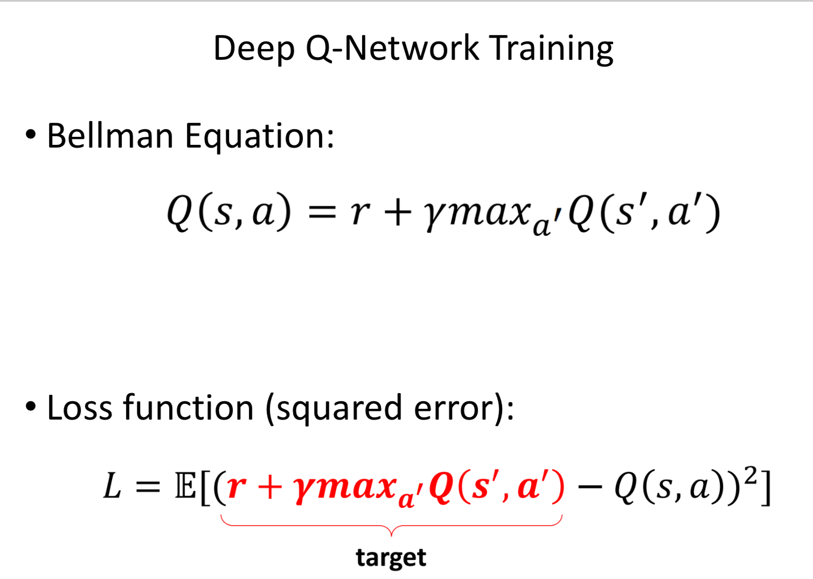

# AI Pool 2021 - Reinforcement Learning - AIO

Ingénieur, nous devons réfléchir à un plan B si nous ne réussissons pas à sauver la Terre.

La solution à l'étude est une migration de masse vers une nouvelle planète. Le candidat le plus prometteur est Io, un satellite naturel de Jupiter.
Pour nous préparer, nous réaliserons d'abord un retour sur notre bon vieux satellite, la Lune.

L'équipe scientifique a ainsi besoin d'une IA capable d'assister les astronautes lors de la procédure d'alunissage.
Nous avons développé un simulateur dernier cri qui vous aidera dans cette tâche.

L'équipe scientifique a de plus retrouvé dans ses manuels un algorithme qui pourra vous aider, le Deep Q-learning.

# Manuel Deep Q Learning

Le problème majeur du Q learning, c'est la Q table.
Plus l'environnement est complexe, plus la table sera grande, et plus elle demandera de mémoire et de puissance de calcul pour être stockée et manipulée.

De plus dans un environement aussi complexe qu'un alunissage, il est impossible de prévoir tous les cas possibles.
Il nous faut donc remplacer la Q table par une fonction qui pour un état et une action donnée, estime au mieux l'espérance de cet état.

Vous savez ce qui est très efficace pour estimer une fonction ? Les réseaux de neurones !

Au lieu de stocker chacune des valeurs possibles, vous allez entrainer un modèle de Deep Learning qui servira à prédire l'espérance d'un état et d'une action donnée.
Ce modèle est appelé le **Policy Network**.

Quelles sont les étapes à suivre ?

- On stocke régulièrement notre tuple `(state, action, reward, next_state)` dans la mémoire.
- Au bout de *N* actions, on commence l'entrainement de notre modèle sur notre mémoire.
- Pour un état *S* que l'on donne à notre network *f*, *f* estimera la Q-value pour chacunes des actions possibles (*Q(S,a_x)*).
- On réalise une prédiction de *S'* avec *f* pour obtenir notre Q-value maximum estimée.
- On calcule notre Q-value réelle en utilisant l'équation de Bellman.
- On calcule une loss MSE en comparant la sortie de *f*, la Q-value estimée, avec notre Q-value réelle.

On entrainera alors notre modèle à minimiser cette loss comme pour n'importe quel autre modèle de Deep Learning.

On répétera ces étapes sur chacuns des états rencontrés dans l'environement, jusqu'à avoir suffisament minimisé la loss, et ainsi avoir une Q-fonction précise.

# Consignes
- Créez un modèle de Deep Learning capable de recevoir un state.
- Créez une classe `Memory` (Replay memory) pour stocker les actions et les états.
- Créez une classe `Agent` qui contiendra le modèle, ainsi que les différentes méthodes pour le faire apprendre.
- Résolvez l'environement (CartPole-v1)[https://gym.openai.com/envs/CartPole-v1/] pour vous assurer du bon fonctionnement de votre agent
- Soumettez un code capable de résoudre l'environnement (LunarLander-v2)[https://gym.openai.com/envs/LunarLander-v2/]

**few tips**
- On souhaite avoir autant d'output dans notre modèle que d'actions possibles dans notre environement.
- On ne souhaite pas avoir de fonction d'activation pour le dernier layer puisque que l'on souhaite avoir l'estimation brute de l'espérance.
- On peut souhaiter de faire du préprocessing sur notre state si nécessaire.
- On souhaite mélanger notre mémoire régulièrement pour éviter toute corrélations inattendue entre les données.
- Pensez à l'intégration GPU pour l'entrainement de votre modèle.

**Useful links:**
- What is Deep Q-learning: https://youtu.be/wrBUkpiRvCA
- Training a Deep Q-Network: https://youtu.be/0bt0SjbS3xc
