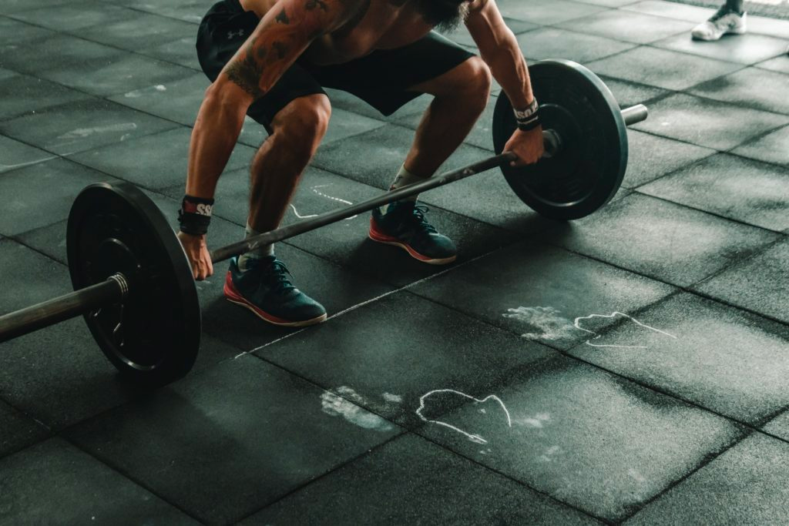
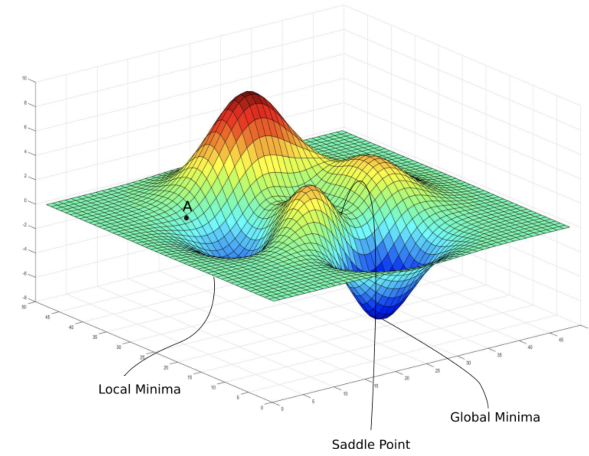
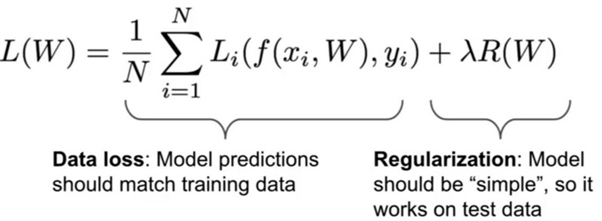
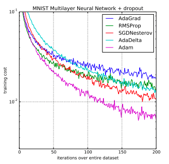

<p align="center"></p>

## Gradio interface 📱

Discover Gradio, a tool to create interfaces for your artificial intelligence applications.

You will:
- Automatic download your dataset
- Save and load your weights of your model
- Display your accuracy and loss
- Create a Gradio interface
- Use different Gradio interfaces
- Share your app on the Gradio platform

## Documentation

- [Torch](https://pytorch.org/docs/stable/index.html)
- [Numpy](https://numpy.org/doc/)
- [Gradio](https://gradio.app/docs/)
- [Matplotlib](https://matplotlib.org/3.1.1/index.html)


## Workspace

For this workshop you will not use a jupyter notebook. You will create your own application.
You will follow this architecture to start and then you are free to change it to make your application grow.

```
Folder: app

├── my_app.py
├── neural_network.py
│   dataset/
│   └── (Empty folder)
│   model/
│   └── (Empty folder)
```

## Dataset

<p align="center"></p>

In this workshop you will use the [CIFAR10](http://www.cs.toronto.edu/~kriz/cifar.html).

## Step 0: Initialization

All the required information to install the workshop's dependencies are given in the [SETUP.md](./SETUP.md)

## Step 1: Class app

Create a class called `app` that will be the main class of your application.

In the class `app` you will add the following attributes:
- `model`: the model of your application
- `epoch`: the number of epochs
- `batch_size`: the batch size
- `learning_rate`: the learning rate
- `classes`: the list of classes

If you don't know what is a class, check the [Python documentation](https://docs.python.org/3/tutorial/classes.html)

## Step 2: Add the dataset

- In your class app create an attribute `train_set` and an attribute `train_loader` that will contain the dataset.
- In your class app you will create an attribute `classes` that will contain the classes of your dataset. (Take the classes in the `train_set`)
- Create a method called `add_dataset` that will return a dataloader.

You can use this for the `classes:
```python
self.classes = ('plane', 'car', 'bird', 'cat', 'deer', 'dog', 'frog', 'horse', 'ship', 'truck')
```

The `add_dataset` method will receive a `dataset_path` and if you want a train set or test set.

For this step the torchvision [dataloaders](https://pytorch.org/vision/stable/generated/torchvision.datasets.CIFAR10.html#torchvision.datasets.CIFAR10).


## Step 2.5: Check if the dataset is already downloaded

In your method `add_dataset` you will check if the dataset is already downloaded.
If it is downloaded, check if the dataset is correct. (If you setup the dataset correctly, the dataset will be automatically downloaded and checked)
For automatic download, you will to set the `download` parameter to `True`.

## Step 3: Create the model

<p align="center"></p>

Create a class called `model` that will contain the model of your application in the `neural_network.py` file in `app` folder.

For your parameters, you will know this informations:
- Size of image: 32x32x3
- Start with 3 channels
- Use a kernel size of 5

In your init method of the class `model` you will add the following attributes:
- `conv1`: the first convolutional layer
- `pool`: the pooling layer
- `conv2`: the second convolutional layer
- `linear1`: the first linear layer
- `linear2`: the second linear layer
- `linear3`: the third linear layer

You can use [this documentation](https://pytorch.org/tutorials/beginner/blitz/cifar10_tutorial.html#define-a-convolutional-neural-network) for the convolutions

Create a forward method that will receive the input of your model and use the model variables.

## Step 4: Implement the training

<p align="center"></p>

Create a method called `train` that will train your model.

In the method `train` you will:
- Create a loss function
- Create a optimizer
- Keep track of the loss and accuracy
- Create a loop to train the model

You must use your hyperparameters in your app to train your model.

Documentation for understanding the training: [this](https://pytorch.org/tutorials/beginner/blitz/cifar10_tutorial.html#train-the-model)

### Loss function

<p align="center"></p>

A prediction task can be considered as a simple optimization task, where the model tries to optimize its performance by predicting the correct value. The actual value that we optimize is called the "loss" (which we try to minimize, of course). To do this, the model must be able to measure what is called the "loss", which depends on the problem.

#### The function
<p align="center"></p>

#### Implementation

In this workshop we will use a loss function already coded and included in PyTorch.

We advise you to use the `CrossEntropyLoss` loss function.

### Optimizer

#### The function

<p align="center"></p>

Optimizers are algorithms or methods used to change the attributes of the neural network such as weights and learning rate to reduce the losses. Optimizers are used to solve optimization problems by minimizing the function.

#### Implementation

In this workshop we will use an optimizer algorithm already coded and included in PyTorch.

We advise you to use the `Adam` optimizer.

## Step 5: Display the loss and accuracy

Use Matplotlib for this step.

In one figure you will display the loss and accuracy of the training.

You will save the data epoch by epoch.

You can use this [documentation](https://niruhan.medium.com/drawing-loss-curves-for-deep-neural-network-training-in-pytorch-ac617b24c388) for keeping track of the loss and accuracy.

Check the documentation of [Matplotlib plot](https://matplotlib.org/stable/api/_as_gen/matplotlib.pyplot.plot.html).


## Step 6: Save the model

After your training, you will save your model in the `model` folder.

With `torch` you can simply [save your models](https://pytorch.org/tutorials/beginner/saving_loading_models.html).

So remember to load the template if it is already present in the appropriate file.

## Step 7: Predict an image

Create a method named `predict_image` that will predict an image.
This method will receive an image and return the prediction.
The prediction is an element of the `classes` attribute.

## Step 8: Create the Gradio interface

Create a [gradio interface](https://gradio.app/docs/#interface) with for inputs an image.

For this, you need a function called `execute_predict` (You will create this function in the next step) that will receive an image and return the prediction.

## Step 9: Take image, reformat it and predict it

In this step you will create a function called `execute_predict` that will receive an image and return the prediction.

In reality your image is a numpy array.

## Step 9.1: Reformat the image

You must create a function called `reformat_image` that will reformat the image.

For this function you must proceed as follows:
- Convert your numpy array to a tensor image
- Resize the image to 32x32 (Size of images in the dataset)
- Reformat your image with a composed transformation (A composition of a resize and a conversion to tensor)

## Step 9.2: Normalize the image

You must create a function called `normalize_image` that will normalize the image.

For normalize an image with a Normalize function you need to use the following parameters:
- Mean
- Std

To calculate the mean and std of the dataset you need to create a function with the following process:
- Create a variable called `channels_sum`, `channels_squared_sum` and `batch_num`
- Create a loop that will iterate over the dataset
  - Add to `channels_sum` the result of a function `mean` (the dimension for this is [0,2,3])
  - Add to `channels_squared_sum` the result of a function `mean` (the dimension for this is [0,2,3]), don't forget to square the data before sending it to the function `mean`
  - Add 1 to `batch_num`
- Set `mean` variable to the result of `channels_sum` divided by `batch_num`
- Set `std` variable to this equation: `std = sqrt(E[X^2] - (E[X])^2)`
- Return the mean and std

[This documentation](https://towardsdatascience.com/how-to-calculate-the-mean-and-standard-deviation-normalizing-datasets-in-pytorch-704bd7d05f4c) can be help you.

## Step 9.3: Execute the prediction

With the last step, you are a tensor image, you need to convert this to a float image.

Now you have all tools to predict an image.

Use your `predict` function for return the prediction.

## Step 10: Share your app on the Gradio platform

With Gradio you can share your application. This is integrated in the Gradio interface. Check the [Gradio documentation](https://docs.gradio.org/en/latest/).

Share your app with your friends and test it.

## Step 11: Keep smiling 😃

You have finished the workshop.

Don't forget to share your code on the Github Classroom repository.


## Writer

| [<br><sub>Clément Loeuillet</sub>](https://github.com/laybraid) |
|:---------------------------------------------------------------------------------------------------------------------------:|

<h2 align=center>
Organization
</h2>
<br/>
<p align='center'>
    <a href="https://www.linkedin.com/company/pocinnovation/mycompany/">
        
    </a>
    <a href="https://www.instagram.com/pocinnovation/">
        
    </a>
    <a href="https://twitter.com/PoCInnovation">
        
    </a>
    <a href="https://discord.com/invite/Yqq2ADGDS7">
        
    </a>
</p>
<p align=center>
    <a href="https://www.poc-innovation.fr/">
        
    </a>
</p>

> :rocket: Don't hesitate to follow us on our different networks, and put a star 🌟 on `PoC's` repositories.
