# Simulateur

## Step 0: Go to the simulator

Go to [TinkerCad](https://www.tinkercad.com/)  
  
Log-In and create new Circuit.  

#

## Exercise 1

    
 🛠️ Required Hardware:

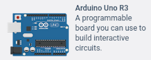 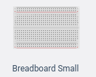  
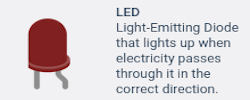 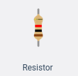

  
  
**Instruction**: Make a circuit linking a board with a led so that the led can be turned on.  
  
>**Constraints**: You don't have to produce any code for this execise. You may not use the 3.3V pin of your board.  
  
>⚠️ Can the led take the voltage sent by the board ? 

#

## Exercise 2

    
 🛠️ Required Hardware:

   
  

  
  
**Instruction**: Make the LED flash every second.
  
>**Constraints**: Null.

#

## Exercise 3

    
 🛠️ Required Hardware:

   
   
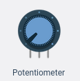

  
  
**Instruction**: Using the circuit from exercise 2, make the LED blink delay dependent on the potentiometer.
  
>**Constraints**: Null.

#

## Exercise 4

    
 🛠️ Required Hardware:

   
   

  
  
**Instruction**: Using the circuit from exercise 3, make sure that the LED does not blink anymore, and that the intensity of its lighting depends on the value of the potentiometer.
  
>**Constraints**: Null.

>⚠️ Learn more about the `PWM` pins

#

## Exercise 5

    
 🛠️ Required Hardware:

   
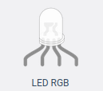 **x3**  
 

  
  
**Instruction**: Using a potentiometer, vary the color of the RGB LED from red to blue
  
>**Constraints**: Null.

#

## Exercise 6

    
 🛠️ Required Hardware:

   
**x6****x6**

  
  
**Instruction**: Flash 6 LEDs, one at a time, back and forth.
  
>**Constraints**: Null.

#

## Exercise 7

    
 🛠️ Required Hardware:

   
**x6** **x6**  

  
  
**Instruction**: Using a potentiometer, control the number of LEDs lit on a row. Turning the potentiometer knob will turn more LEDs on or off.
  
>**Constraints**: Null.

#

## Exercise 8

    
 🛠️ Required Hardware:

   
   
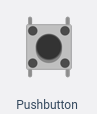

  
  
**Instruction**: Make the button change the state (on/off) of the LED with each press.
  
>**Constraints**: Null.

>⚠️ INPUT_PULLUP

#

## Exercise 9

    
 🛠️ Required Hardware:

   
   
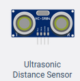

  
  
**Instruction**: Create a new circuit that will retrieve the distance given by the ultrasonic sensor and if it is less than 30cm, turn on the LED.
  
>**Constraints**: Null.

#

## Exercise 10

    
 🛠️ Required Hardware:

   
   

  
  
**Instruction**: Using the circuit from exercise 9, display the distance given by the sensor, and send it in cm via a serial connection to your computer.
  
>**Constraints**: Null.

#

## Exercise 11

    
 🛠️ Required Hardware:

   
 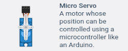

   

**Instruction**: Create a new circuit that drives the servo motor position according to the potentiometer. 
  
>**Constraints**: Null.

#

## Exercise 12

    
 🛠️ Required Hardware:

   
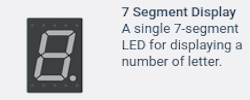 **x2**

   

**Instruction**: Create a new circuit that display the numbers from 0 to 9 on the 7 segment display with a time of one second between each digit
  
>**Constraints**: Null.  

>⚠️ How to make your code clean in order to light each segment properly? and get a correct display !

#

## Exercise 13

    
 🛠️ Required Hardware:

   
  **x2**  
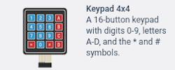

   

**Instruction**: take the circuit from the previous exercise and add a 4x4 keypad. The number selected on the Keypad must be displayed on the seven segment display.
  
>**Constraints**: Null.  

>⚠️ check Keypad.h

#

## Exercise 14

    
 🛠️ Required Hardware:

   
   
 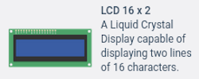

   

**Instruction**: Create a new circuit that will get the keypad inputs and display them on the lcd screen.
  
>**Constraints**: Null.  

>⚠️ check LiquidCrystal.h and what is the purpose of the potentiometer ?

>🟩 **Bonus**: Create game with Keypad and lcd display (ENJOY :))

#

## Exercise 15

    
 🛠️ Required Hardware:

   
**x10** **x10**  
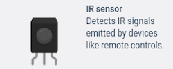  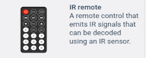

   

**Instruction**: Create a new circuit that will get the digital inputs from the remote and turn on or off its associated LED.  
When I click on 0, the first LED of my row turns on and when I press 0 again, the LED turns off
  
>**Constraints**: Null.  

>⚠️ check IRremote.h and [IR (infrared)](https://learn.sparkfun.com/tutorials/ir-communication/all)

#

## 🎉 Congratulation !

You now know the basics of the arduino. Feel free to use your imagination to create circuits. Or combine the previous exercises for new results.

#

## Authors

| [ Coline Seguret](https://github.com/Cleopha) |
| :---: |
<h2 align=center>
Organization
</h2>
 

    
    
    
    

    

> 🚀 Don't hesitate to follow us on our different networks, and put a star 🌟 on `PoC's` repositories.