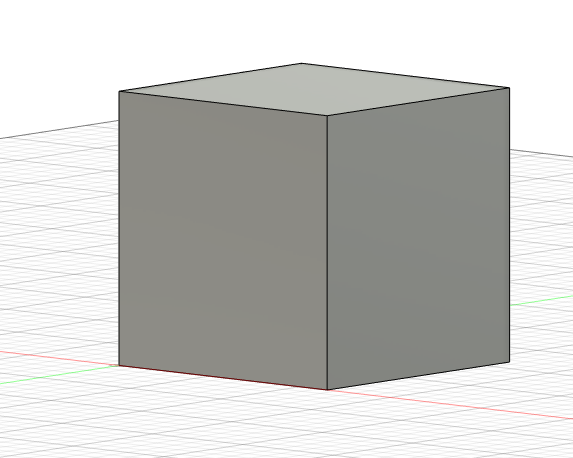
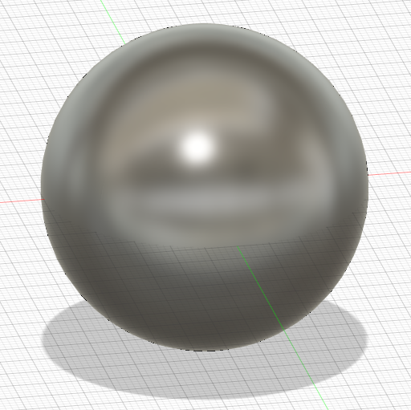
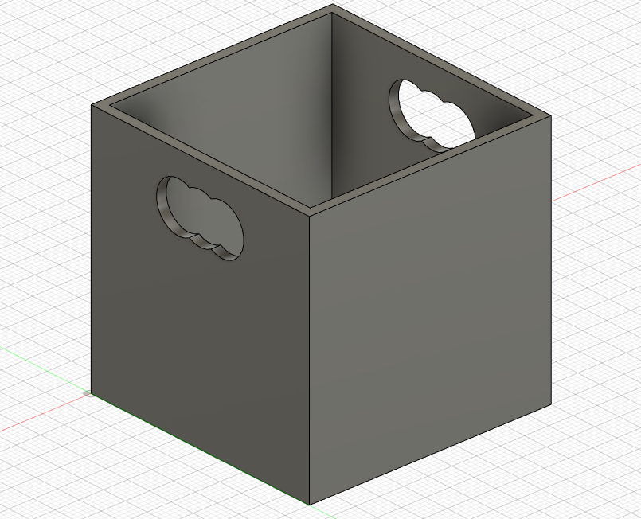
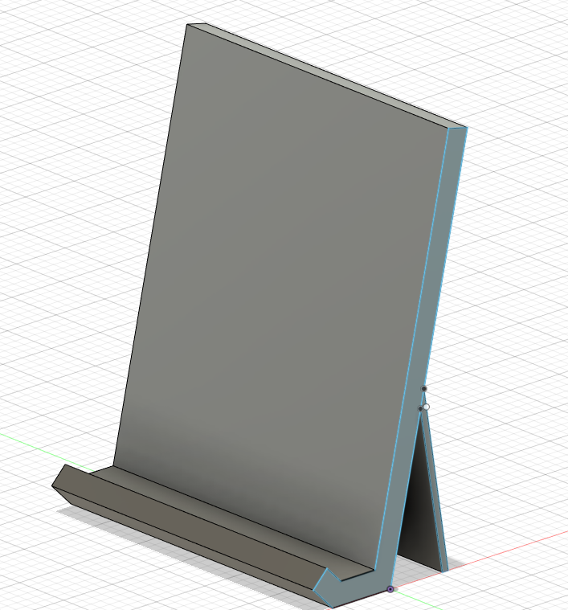
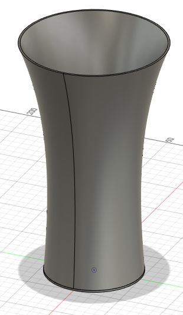
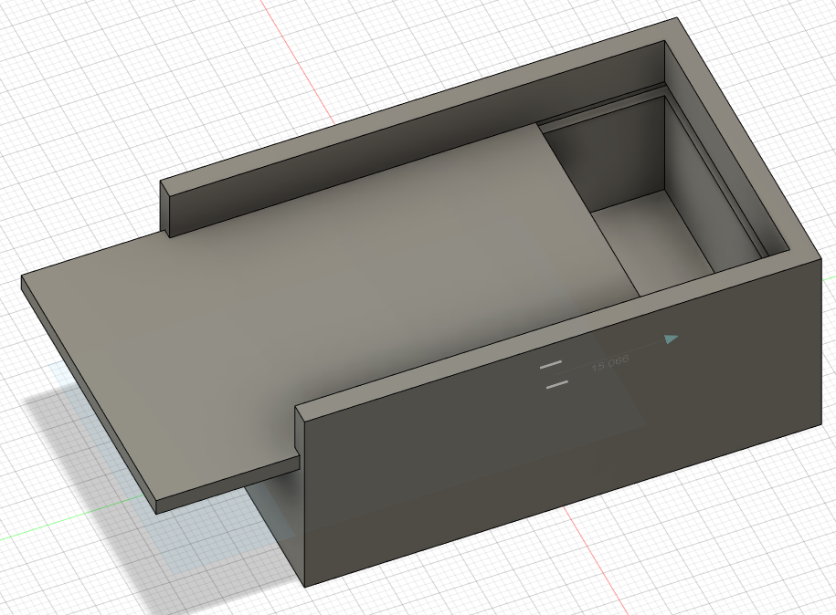
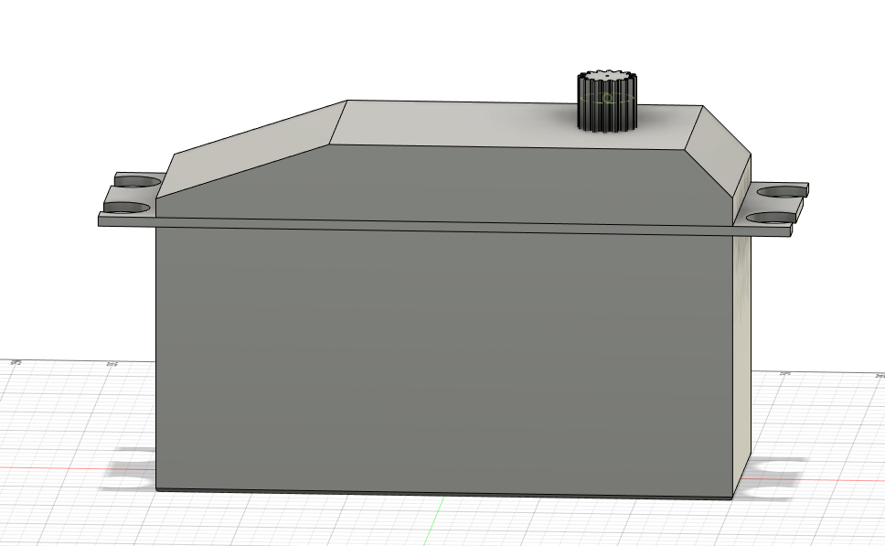

# Hardware Pool: 3D modelling

In this workshop you will learn the basics of 3D modeling with Fusion 360. 💪
The exercises are of increasing difficulty.

You will first learn how to create objects and then how to link several objects to create a larger one.

At the end of this workshop you will be creating simple objects. These objects can be printed with a 3D printer.

In case of blockages, do not hesitate to ask the workshop leader.

## Setup:

The first step is to install Fusion 360, you can find the necessary documentation just below: 📚
You go to this [link](https://www.autodesk.fr/education/edu-software/overview?sorting=featured&filters=individual) and go to **mise en route**.

You just need to create an account with the epitech link.

## Exercise 1: First things first: the basics

### 1.1 Make a Square
Your first object is the creation of a square.
You will learn how to **extrude** 🎉

### 📌 Tasks:
Make a cube of 57.58mm side (Careful, we'll come and check the measurements!)

## 1.2 Make a Sphere ⚫

### 📌 Tasks:
Still more, you can now try to make your first sphere. 👀

## Exercise 2: Let's get technical

You now know how to make solid shapes.
We can move on to the second step of this workshop.

### 2.1 Make empty Shape
### 📌 Tasks:
You will be able to use your basics from the previous step to make an empty shape.
Your handle should be rounded like on the picture below.

Make a box with handles.

### 2.2 Telephone stand 📱
### 📌 Tasks:
You might as well mix the useful with the pleasant.
An object that is often needed without having it at hand. We will create a phone holder.

### 2.3 Make a Vase

We will now move on to a much more complex step. You will be able to make your first vase.

### 📌 Tasks:
Vases can have any shape.
Today we are going to ask you to create a **horn** vase.

You have a very good representation of the type of vase you are asked to make below.

## Exercise 3: Movement 💨

Making a single object is good but combining different parts to create an object is better but also more complex.

It's time to stay focused. 👓

### 📌 Tasks:
First create your empty box.
Then adjust it to allow for a sliding top.

In fact, make a box with a sliding top

## Exercise 4: Realer than real 🔧

### 📌 Tasks:
Make a servomotor. Nothing too fancy, but try to get as close as you can to the model.

## Exercise 5:

### 📌 Tasks:
> For this exercise, you will have to make a car 🚙 , a rocket 🚀 , or even a pocket watch if that is what you like. The important thing is that it is printable and that it measures less than 10 cm³. This is the average size that is suitable for the 3D printer. 🎆

## 🎉 Congratulation !

You now know the basics of 3D modelling. Feel free to use your imagination to implement many other shapes.
Or combine the previous exercises for new results.

## Authors

| [ Axel ZENINE](https://github.com/Azzzen) | 
| :---: |
<h2 align=center>
Organization
</h2>
 

    
    
    
    

    

> 🚀 Don't hesitate to follow us on our different networks, and put a star 🌟 on `PoC's` repositories.
