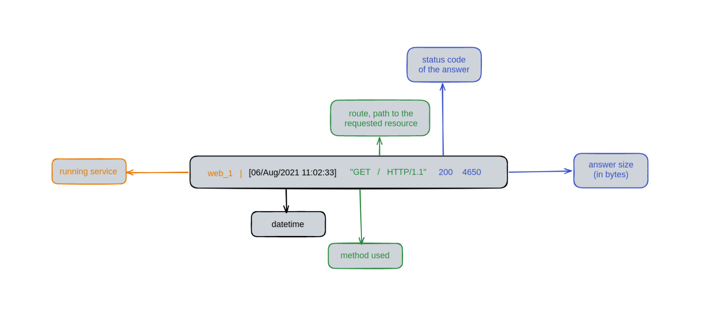

# 10. Learn the differences between HTTP and IPFS

## 💫 Table of contents

* [Step 0 - Setup](README.md#🔧-step-0---setup)
* [Step 1 - HTTP](README.md#step-1---http)
  * [Discover the basics](README.md#✏️-10-discover-the-basics)
  * [Storage](README.md#💾-11-storage)
* [Step 2 - IPFS](README.md#step-2---ipfs)
  * [Improve the storage](README.md#🕸️-20-improve-the-storage)
  * [Retrieve](README.md#📥-22-retrieve)
* [Going further](README.md#🚀-going-further)
  
In this Workshop, you will learn :

✔️ The basics of HTTP

✔️ The basics of IPFS, and why in some cases it is better than HTTP

✔️ How to change a centralized storage into a distributed one via IPFS with Infura !

## 🔧 Step 0 - Setup

Please follow each instruction on the [SETUP.md](SETUP.md) file.

## Step 1 - HTTP

### ✏️ 1.0 Discover the basics

Wanna launch the back-end? It's very simple, just execute the `./backend` binary.

you should have this log :

```bash
[GIN-debug] [WARNING] Creating an Engine instance with the Logger and Recovery middleware already attached.

[GIN-debug] [WARNING] Running in "debug" mode. Switch to "release" mode in production.
 - using env: export GIN_MODE=release
 - using code: gin.SetMode(gin.ReleaseMode)

[GIN-debug] GET    /images                   --> main.getImages (4 handlers)
[GIN-debug] GET    /images/:id               --> main.getImageByID (4 handlers)
[GIN-debug] POST   /upload                   --> main.uploadImage (4 handlers)
[GIN-debug] GET    /uploads/*filepath        --> github.com/gin-gonic/gin.(*RouterGroup).createStaticHandler.func1 (4 handlers)
[GIN-debug] HEAD   /uploads/*filepath        --> github.com/gin-gonic/gin.(*RouterGroup).createStaticHandler.func1 (4 handlers)
[GIN-debug] [WARNING] You trusted all proxies, this is NOT safe. We recommend you to set a value.
Please check https://pkg.go.dev/github.com/gin-gonic/gin#readme-don-t-trust-all-proxies for details.
[GIN-debug] Listening and serving HTTP on 0.0.0.0:8080
```

As you can see, there is different route for the back-end of our website. You can open your favorite browser like Firefox or Chrome (or Opera,
no discrimination here) and go to this URL: [http://0.0.0.0:8080/images](http://0.0.0.0:8080/images).

You should see an empty array !!

If you want to shut down the server, use `Ctrl` + `C` and then run `docker stop ${id}`.

Now it's time to wake the front-end up.

Go to [the source of the front-end](./openocean/frontend/) and type `bun i` to download the dependencies. Then, type `bun dev` to launch the front-side of our web-app.

Now visit this URL: [localhost:5173](localhost:5173). You should see a pretty UI made by two genius.

### 💾 1.1 Storage

Go to [Unsplash](https://unsplash.com/photos/a-woman-sitting-at-a-table-using-a-cell-phone-nplkFSNschY) website and download the image.
By the way, you can look for any other image you prefer on this website, it is free and open source. For the example, we are going to stick with this image.
Go back to [http://localhost:5173/](http://localhost:5173), scroll down and click on the button on the `up right`.
Fill the form correctly and validates it.

Now, look at your terminal, you should see those strange logs appear:

```bash
[GIN] 2024/12/02 - 19:10:29 | 200 |      85.347µs |      172.17.0.1 | GET      "/images"
[GIN] 2024/12/02 - 19:10:29 | 200 |     140.871µs |      172.17.0.1 | GET      "/images"
[GIN] 2024/12/02 - 19:10:37 | 200 |     2.93712ms |      172.17.0.1 | POST     "/upload"
[GIN] 2024/12/02 - 19:10:37 | 200 |      30.521µs |      172.17.0.1 | GET      "/images/08245a6c-0843-4f68-bb41-c1dea72369c7"
[GIN] 2024/12/02 - 19:10:37 | 200 |      15.784µs |      172.17.0.1 | GET      "/images/08245a6c-0843-4f68-bb41-c1dea72369c7"
[GIN] 2024/12/02 - 19:10:37 | 200 |    5.895332ms |      172.17.0.1 | GET      "/uploads/65fb793f-a8b5-4c88-9fbc-6432d40961ba.png"

```

Let me explain:
The first part of the message is obviously the date-time. The second one is two numbers. The `200` is the most interesting : it is a status, preview code. `200` means that the server is OK to give us that page from the `/images` route, and it has been delivered correctly.
Then, the time it took to respond to the request. Afterward, the address which requested. And finally, the method, `GET`, because we want to just get the page ; we are asking the server to give us the `/images` route which is the home page.


*Scheme of a HTTP request*

>💡 What does `POST` means ?

`POST` is another **HTTP method** than `GET`. When you fill the form earlier, it was **you** that was giving the server
some information :that is the main difference between `POST` and `GET`.

> 💡 Learn more about HTTP methods [here](https://fr.wikipedia.org/wiki/Hypertext_Transfer_Protocol).

Then, go to look at our `uploads` folder : you have the file you just downloaded in here !
>💡 This is how HTTP works. When retrieving data, HTTP focuses on **location**.

## Step 2 - IPFS

> 💡 HTTP is cool but has its limits : if the server is down, you won't be able to retrieve the data stored. Furthermore, your government can easily block access to certain servers by their IPs that host particular website for censure purposes.
Let's see how IPFS answers this issues.

At its core, IPFS is a [distributed system](https://en.wikipedia.org/wiki/Distributed_computing) for storing and accessing files, websites, applications, and data.
Instead of referring to data (photos, articles, videos) by **location**, or which server they are stored on, IPFS refers
to everything by that data’s [hash](https://docs.ipfs.io/concepts/hashing/#hashes-are-important), meaning the **content itself.**

The idea is that if you want to access a particular page from your browser, IPFS will ask the entire network, “does anyone
have the data that corresponds to this hash?” A node on IPFS that contains the corresponding hash will return the data, allowing you to access it from anywhere (and potentially even offline).

If this is not enough clear for you, I strongly advise you to refer to this [video (Simply Explained IPFS)](https://www.youtube.com/watch?v=5Uj6uR3fp-U).

### 🕸️ 2.0 Improve the storage

Here is what we are going to do : We are going to upload our files directly on IPFS and not locally anymore.
Instead of having the file locally, let's pin it with [Pinata](https://pinata.cloud/). Which is a pinning service.

1. Go to `frontend/src/hooks/` and create a new hook `usePinFileToIPFS.ts` as a manner of `usePostImage.ts` It should call the [list file Pinata API route](https://docs.pinata.cloud/api-reference/endpoint/list-files).
> 💡 Don't forget to create an [Pinata API & Gateway key](https://app.pinata.cloud/developers/api-keys) and write it down into your a `.env`. You can create one by typing in your terminal in `frontend/` folder:

 ```
cp .env.dist .env
```

2. Go to `frontend/src/pages/Upload.tsx` and modify the code of the upload view to communicate with your new hook in order to upload the file there.
3. Go https://app.pinata.cloud/pinmanager and make sure the hash of the song appears.

<details>
<summary>Some Trouble with IPFS API ?</summary>
    Here is some links that could help you:
    <li>
        <a href="https://en.wikipedia.org/wiki/API">What is an API ?</a>
    </li>
    <li>
        <a href="https://docs.pinata.cloud/quickstart">Infura IPFS API</a>
    </li>
    <li>
        <a href="https://axios-http.com/fr/docs/intro">ipfs-Api python package</a>
    </li>
</details>

### 📥 2.2 Retrieve

Last step : if anyone wants to see from our website some images, we need to get it from IPFS.
Since you did the previous step, this one would seem easy : in your `src/page`
 on the `index.tsx`, do the same thing as previously but instead of adding a file, call the get method to retrieve your image.

## 🚀 Going further

A very cool feature with IPFS is that if someone is having an IPFS node running on its machine and download your image then you deleted it, you will be able to retrieve it from its node !

* Learn [how](https://docs.ipfs.io/how-to/command-line-quick-start) you can deploy and configure your own IPFS node.
* Want to store a lot of data on IPFS but being the only one that can access it? Look at [OrbitDB](https://orbitdb.org/).

## Authors

| [<br><sub>Sacha Dujardin</sub>](https://github.com/Sacharbon) |
| :---: |

<h2 align=center>
Organization
</h2>
<br/>
<p align='center'>
    <a href="https://www.linkedin.com/company/pocinnovation/mycompany/">
        
    </a>
    <a href="https://www.instagram.com/pocinnovation/">
        
    </a>
    <a href="https://twitter.com/PoCInnovation">
        
    </a>
    <a href="https://discord.com/invite/Yqq2ADGDS7">
        
    </a>
</p>
<p align=center>
    <a href="https://www.poc-innovation.fr/">
        
    </a>
</p>

> 🚀 Don't hesitate to follow us on our different networks, and put a star 🌟 on `PoC's` repositories.
