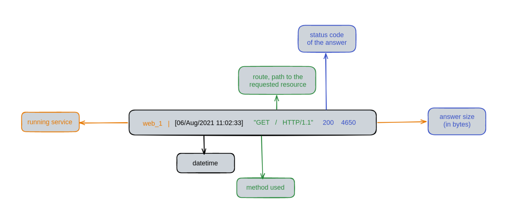

# 3. Learn the differences between HTTP and IPFS !

##  :dizzy: Table of contents
* [Step 0 - Setup](./README.md#wrench-step-0---setup)
* [Step 1 - HTTP](./README.md#step-1---http)
    * [Discover the basics](./README.md#pencil2-10-discover-the-basics)
    * [Storage](./README.md#floppy_disk-11-storage)
* [Step 2 - IPFS](./README.md#step-2---ipfs)
    * [Improve the storage](./README.md#spider_web-20-improve-the-storage)
    * [Retrieve](./README.md#inbox_tray-22-retrieve)
* [Going further](./README.md#rocket-going-further)
  

In this Workshop, you will learn :

:heavy_check_mark: Run a web application with `docker-compose`

:heavy_check_mark: The basics of HTTP

:heavy_check_mark: The basics of IPFS, and why in some cases it is better than HTTP

:heavy_check_mark: How to change a centralized storage into a distributed one via IPFS with Infura !

## :wrench: Step 0 - Setup
Please follow each instruction on the [SETUP.md](./SETUP.md) file.

## Step 1 - HTTP
### :pencil2: 1.0 Discover the basics
Wanna launch the platform? Alright, make sure you are on the [sources](./sources) directory where the `Dockerfile` and
`docker-compose.yml` are.

Build the multi service container :
```bash
sudo docker-compose build
```
You have to only use this command once. After several steps, you should have this output:
```bash
Successfully built a998a543950c
Successfully tagged music-share_web:latest
```
> :bulb: The number `a998a543950c` is the id of your container, it's ok if yours is different.

Then, each time you want to launch your website, run :
```bash
docker-compose up
```
you should have this log :
```bash
Starting music-share_db_1 ... done
Starting music-share_web_1 ... done
Attaching to music-share_db_1, music-share_web_1
db_1   | 
db_1   | PostgreSQL Database directory appears to contain a database; Skipping initialization
db_1   | 
db_1   | 2021-08-02 20:48:37.281 UTC [1] LOG:  starting PostgreSQL 13.2 (Debian 13.2-1.pgdg100+1) on x86_64-pc-linux-gnu, compiled by gcc (Debian 8.3.0-6) 8.3.0, 64-bit
db_1   | 2021-08-02 20:48:37.281 UTC [1] LOG:  listening on IPv4 address "0.0.0.0", port 5432
db_1   | 2021-08-02 20:48:37.281 UTC [1] LOG:  listening on IPv6 address "::", port 5432
db_1   | 2021-08-02 20:48:37.283 UTC [1] LOG:  listening on Unix socket "/var/run/postgresql/.s.PGSQL.5432"
db_1   | 2021-08-02 20:48:37.286 UTC [25] LOG:  database system was shut down at 2021-08-02 20:48:32 UTC
db_1   | 2021-08-02 20:48:37.289 UTC [1] LOG:  database system is ready to accept connections
web_1  | No changes detected
web_1  | Operations to perform:
web_1  |   Apply all migrations: admin, auth, contenttypes, musicshare, sessions
web_1  | Running migrations:
web_1  |   No migrations to apply.
web_1  | Watching for file changes with StatReloader
web_1  | Performing system checks...
web_1  | 
web_1  | System check identified no issues (0 silenced).
web_1  | August 02, 2021 - 20:48:39
web_1  | Django version 3.1.6, using settings 'music_share_project.settings'
web_1  | Starting development server at http://0.0.0.0:8000/
web_1  | Quit the server with CONTROL-C.

```
As you can see, `db_1` is our database which seems okay and ready to accept new connections,
and `web_1` is the backend of our website. You can open your favorite browser like Firefox or Chrome (or Opera,
no discrimination here) and go to this url : [http://0.0.0.0:8000/](http://0.0.0.0:8000/).

You should see our beautiful website !!

If you want to shut down the server, use `Ctrl` + `C` and then run `docker-compose down -v`.

### :floppy_disk: 1.1 Storage

Go to the [freearchivemusic](https://freemusicarchive.org/music/Scott_Holmes/rock-background-music/country-road-drive)
website and download the song.
By the way, you can look for any other genres of music you prefer on this website, it is free and open source. For the example, we are going to
stick with this song.
Go back to [http://0.0.0.0:8000/](http://0.0.0.0:8000/), scroll down and click on the button `upload a song`.
Fill the form correctly and validates it. 

You can find the code of the form in [./musichare/forms.py](./sources/musicshare/forms.py), and the associate model object in
[./musicshare/models.py](./sources/musicshare/models.py).

Now, look at your terminal, you should see those strange logs appear:
```bash
web_1  | [06/Aug/2021 11:02:33] "GET / HTTP/1.1" 200 4650
web_1  | [06/Aug/2021 11:02:37] "GET /upload/ HTTP/1.1" 200 4640
web_1  | [06/Aug/2021 11:02:57] "POST /upload/ HTTP/1.1" 302 0
web_1  | [06/Aug/2021 11:02:57] "GET /success/ HTTP/1.1" 200 4360
web_1  | [06/Aug/2021 11:02:59] "POST / HTTP/1.1" 200 5120
web_1  | [06/Aug/2021 11:02:59] "GET /media/static/Scott_Holmes_Music_-_Country_Road_Drive.mp3 HTTP/1.1" 200 8983053
```
Let me explain:
The first part of the message is obviously the datetime. The second one is the method, `GET`, because we want to just
get the page ; we are asking the server to give us the `/` route which is the home page.
Then, the `HTTP` protocol and finally two numbers. The `200` is the most interesting : it is a status, preview code. `200` means
that the server is ok to give us that page from the `/` route, and it has been delivered correctly.


*Scheme of a HTTP request*

>:bulb: What does `POST` means ?

`POST` is another **HTTP method** than `GET`. When you fill the form earlier, it was **you** that was giving the server
some information :that is the main difference between `POST` and `GET`.
 
> :bulb: Learn more about HTTP methods [here](https://www.restapitutorial.com/lessons/httpmethods.html).

Now, look at our [/media/static](./sources/musicshare/media/static) folder : you have the mp3 file you just downloaded in here !
>:bulb: This is how HTTP works. When retrieving data, HTTP focuses on **location**. Have you noticed the url ?
First, it is `0.0.0.0` which is your local IP; then `:8000` to signify the port. Finally, the routes or file you want to
get, joined by a `/`. That format does not ring a bell to you ? It is like a path !

## Step 2 - IPFS

> :bulb: HTTP is cool but has its limits : if the server is down, you won't be able to retrieve the data stored. Furthermore,
your government can easily block access to certain servers by their IPs that host particular website for censure purposes.
Let's see how IPFS answers this issues.

At its core, IPFS is a [distributed system](https://blog.stackpath.com/distributed-system/) for storing and accessing files, websites, applications, and data.
Instead of referring to data (photos, articles, videos) by **location**, or which server they are stored on, IPFS refers
to everything by that data’s [hash](https://docs.ipfs.io/concepts/hashing/#hashes-are-important), meaning the **content itself.**

The idea is that if you want to access a particular page from your browser, IPFS will ask the entire network, “does anyone
have the data that corresponds to this hash?” A node on IPFS that contains the corresponding hash will return the data, allowing you to access it from anywhere (and potentially even offline).

If this is not enough clear for you, I strongly advise you to refer to this [vidéo (Simply Explained IPFS)](https://www.youtube.com/watch?v=5Uj6uR3fp-U).

### :spider_web: 2.0 Improve the storage

Here is what we are going to do : We are going to upload our files directly on IPFS and not locally anymore.
Instead of having the file locally, let's have its corresponding hash in our database.

1. Go to [musicshare/models.py](./sources/musicshare/models.py) and add a CharField for the hash.
2. Go to [musicshare/views.py](./sources/musicshare/views.py) and modify the code of the upload view to communicate with IPFS API in order to upload the file there.
   Please use port `5001` for the connection.
3. Open [musicshare/templates/musicshare/index.html](./sources/musicshare/templates/musicshare/index.html) to line `179`
   and make sure the hash of the song appears.
   
<details>
<summary>Some Trouble with IPFS API ?</summary>
    Here is some links that could help you:
    <li>
        <a href="https://en.wikipedia.org/wiki/API">What is an API ?</a>
    </li>
    <li>
        <a href="https://infura.io/docs/ipfs">Infura IPFS API</a>
    </li>
    <li>
        <a href="https://pypi.org/project/ipfs-api/">ipfs-Api python package</a>
    </li>
</details>

To apply your migrations, shut down the server and relaunch it.

Test another time to upload your music, copy past the hash of the newly added song and go to `https://ipfs.infura.io:5001/api/v0/cat?arg={your_hash_here}`.
You should see your song play, even if the server has been shut down !

### :inbox_tray: 2.2 Retrieve
Last step : if anyone wants to download from our website some mp3 songs, we need to get it from IPFS.
Since you did the previous step, this one would seem easy : in your [musicshare/views.py](./sources/musicshare/views.py)
on the `download` view, do the same thing as previously but instead of adding a file, call the `cat` (or `get`) method.

## :rocket: Going further
A very cool feature with IPFS is that if someone is having an IPFS node running on its machine and download your mp3 audio
then you deleted it, you will be able to retrieve it from its node !

* Learn [how](https://docs.ipfs.io/how-to/command-line-quick-start) you can deploy and configure your own IPFS node.
* Want to store a lot of data on IPFS but being the only one that can access it? Look at [OrbitDB](https://orbitdb.org/).

## Authors

| [<br><sub>Adina Cazalens</sub>](https://github.com/NaadiQmmr) | 
| :---: |
<h2 align=center>
Organization
</h2>
<br/>
<p align='center'>
    <a href="https://www.linkedin.com/company/pocinnovation/mycompany/">
        
    </a>
    <a href="https://www.instagram.com/pocinnovation/">
        
    </a>
    <a href="https://twitter.com/PoCInnovation">
        
    </a>
    <a href="https://discord.com/invite/Yqq2ADGDS7">
        
    </a>
</p>
<p align=center>
    <a href="https://www.poc-innovation.fr/">
        
    </a>
</p>

> :rocket: Don't hesitate to follow us on our different networks, and put a star 🌟 on `PoC's` repositories.
