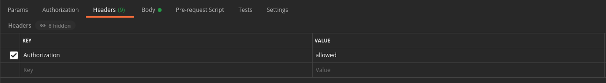
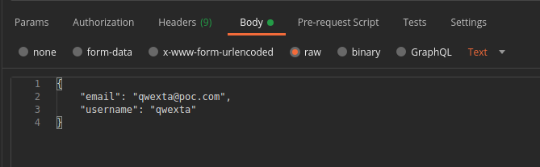

# Workshop 2 - API REST in Go

In this workshop we will learn how to use the main functions of the http package in Go and how to create a REST API.

> 💡 A quick [documentation](https://www.ibm.com/cloud/learn/rest-apis) about REST API.

## Step 0: Initialization

All the required information to install the workshop's dependencies are given in the [SETUP.md](./SETUP.md)

## Step 0.5: The codebase

We designed a boilerplate for this project, it will be useful to start more easily but also to understand all the required parts of an API.  
You should have the following folders:

- `controllers`: this is where you will design your routes endpoint. It will often be a wrapper that calls other APIs or the database itself
- `middlewares`: those are functions that can be called to print logs or check access rights before entering a controller
- `routes`: the core of the router, setting up all the routes handler, with their middlewares and controllers
- `models`: wraps all the database calls

There are plenty of other important packages you may need in a real API, but these are the main ones you can be sure you'll need one time or another. Now let's code 🚀

Add a route on the endpoint `/hello`:
- It uses the `GET` method
- It responds `"hello world"`

> You can test it by going to <http://localhost:8080/hello> in your browser or using `postman`

## Step 1: Let's get started

You have successfully created an endpoint!
The next step is to add message logs because our server doesn't print anything, yet we would like to know when a route is called to know if everything went well.

Create a middleware that logs the traffic of the API:
- Use the `log` native package
- Apply this middleware to the `/hello` route

> Look at the example in the code and at this [article](https://dev.to/karankumarshreds/middlewares-in-go-41j) 😉

> 💡 You can make this middleware global to all routes rather than calling it manually on each and every route you create

  
See how to request with postman 📡

  Enter your URL and the method you wish to use in the titlebar and click `Send`.

  

  Then the result (if there is any) will be printed out at the bottom.

  

## Step 2: Authentication and security

On a real API, there are parts of your routes you only want some people to use.  
To protect some routes from unknown users, we'll have to add another middleware.

- Create an middleware that checks if the request has a header called `Authorization` and if it contains the `allowed` string
- Create a route `/auth/hello` with both middlewares (logs and the one we've just created) to check if it works

> In a real life scenario you will check if the field contains a token, and if this token is valid thanks to [`JSON Web Token`](https://jwt.io/introduction) for example

> `r.Header` is of type `map[string]string`, you should take a look at how to check if a value exists within a map 😉

  
See how to send a header 📡

  Go into the 3rd panel, there you will be able to create the headers that you want to send, toggle the checkbox to send them or not.

  

## Step 3: Vars

Creating routes is nice, but we cannot receive variables from them... To do so, we will use `"github.com/gorilla/mux"` to have modular routes.

Create an endpoint `/whoami/{user}`
- It uses the `GET` method
- It responds `I am $user` with `$user` being the text sent in the URL

> Look at the `{``}` syntax, these brackets indicate which part of the URL will contain vars

> Check the [mux docs](https://github.com/gorilla/mux/blob/master/README.md) for more information

## Step 4: Database and data transfers

Last but not least, we will use the API to manipulate data in a database. As we don't have the time to setup a real database, we've created functions to fake the behavior of a simple database.

> 💡 You must import the `models` package, it contains 3 functions to manipulate users.

You will need to implement an endpoint for:

- `/add`
  - It uses the `POST` method
  - It creates a user thanks to the information given in the `body`
- `/get/{id}`
  - It uses the `GET` method
  - It gets a user based on its `id`
- `/del/{id}`
  - It uses the `DELETE` method
  - It deletes a user based on its `id`

> The `body` will contain a JSON that has the same structure that the one designed in the model package as `model.Users`

  
See how to send JSON in body 📡

  Go into the 4th panel and select the `raw` option, then you can write your JSON (you can also copy this one).

  

  

## Bonus

You should now have all the basis needed to create your own API, if you still want to play around with Go and all its usages, you can take a look at other go features like:
- [`go routines`](https://go.dev/tour/concurrency)
- [`interfaces`](https://gobyexample.com/interfaces)

You can also use a real database with these ORM packages:
- [GORM](https://github.com/go-gorm/gorm/)
- [Ent](https://github.com/facebookincubator/ent)

## Authors

| [ Paul Monnery](https://github.com/PaulMonnery) | [ Théo Ardouin](https://github.com/Qwexta) | [ Grégoire Brasseur](https://github.com/lerimeur)
| :---: | :---: | :---: |
<h2 align=center>
Organization
</h2>
 

    
    
    
    

    

> 🚀 Don't hesitate to follow us on our different networks, and put a star 🌟 on `PoC's` repositories.
