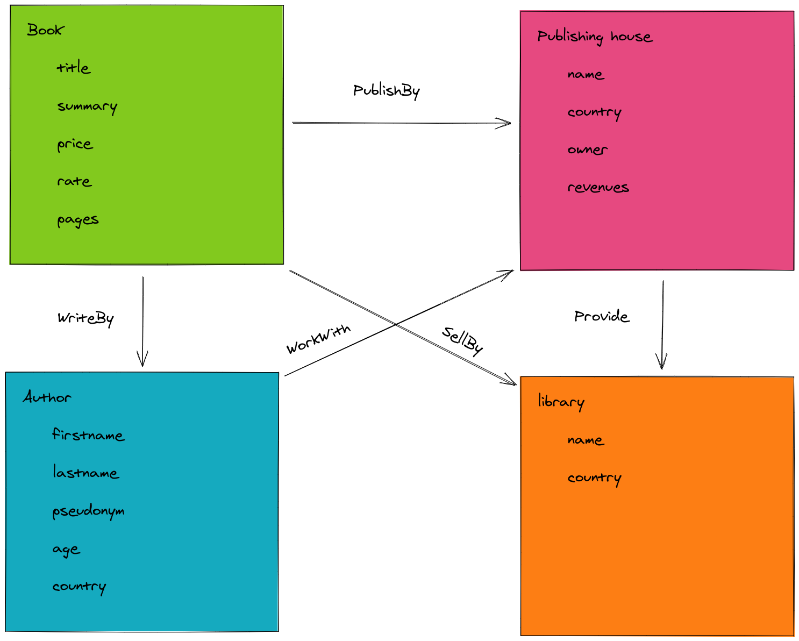

# Workshop 10 - Discover graph database with Neo4j

:heavy_check_mark: Learn graph database concept

:heavy_check_mark: Interact with a graph database

:heavy_check_mark: Use an OGM to simplify your development

:heavy_check_mark: Understand Cypher syntax

:heavy_check_mark: Build basics query through a query builder

:heavy_check_mark: Test your Typescript code with Jest framework

## Step 0 - Initialization

All the required information to start this workshop can be found in [SETUP.md](./SETUP.md).

## Story

A group of publishing houses wants to build a search engine so that their customers can easily find the nearest publishing house selling the book they are looking for.

You have been assigned to the development of the back-end and more specifically, the "**data storage and management**" part.
Your mission is to develop functions to interact with the data stored in a database.

The stored data follow the following scheme:



To store data, several solutions are available to you. First, the use of a [relational database](https://en.wikipedia.org/wiki/Relational_database), classic but efficient,
this system has proven itself for several years and has been adopted by many companies.<br/>
But there are also [graph databases](https://en.wikipedia.org/wiki/Graph_database), also very old but not very popular, these have remained rather discreet, the community is smaller, the tools less popular but just as effective.

Not knowing what to choose, you ask your supervisor for advice, who asks you the following question:<br>
_do your data have close relationships between them, are you going to use these relationships in a recurring way ?_

The answer is of course yes ! A book must always be linked to its author and its sales points, otherwise the platform would be useless.

So you decide to store your data in a graph database. It's time to move on to development, let's go for the discovery of graph databases with [Neo4j](https://neo4j.com/) and its [Typescript](https://www.typescriptlang.org/) [OGM](https://neo4j.com/docs/ogm-manual/current/introduction/) : [Neogma](https://themetalfleece.github.io/neogma-docs/).

## Step 1 - Did you say database ?

### Database 

Our objective is to store data... Wait, where is our database ?

Hmm yes, we must run a database to work with ! Let's launch [neo4j database](https://neo4j.com/) thanks docker.

```shell
$ docker run -d --name workshop-poc-neo4j -p 7474:7474 -p 7687:7687 -e NEO4J_AUTH=$NEO4J_USER/$NEO4J_PASSWORD neo4j
```

> :warning: You must load your environment to make this commands work !
>
> :bulb: If you don't understand the command, check `docker run` [options](https://docs.docker.com/engine/reference/run/)

The container expose :
 - The **graphic interface** on port `7474`, you can go it through this [link](http://localhost:7474/).
 - The `bolt` on port `7687`, you can use it to send request from your code.

Now, we must create a connection directly in the code to communicate with our database.

### Connection

We will use an [OGM](https://en.wikipedia.org/wiki/Object_graph) to simplify our interaction, let's use [Neogma](https://themetalfleece.github.io/neogma-docs/) a complete typed OGM for Neo4j.

- Tip `npm install neogma` to install the dependency in your project.
- Create a file named `appDatabase.ts` in the `src` folder.
- In this file, use Neogma to export a database `client` connected to your database.

> :bulb: You should use the `dbConfig` variable to authenticate your client to your database.

Take a look at the [documentation](https://themetalfleece.github.io/neogma-docs/docs/Getting-Started#initializing) to learn how set up a client.

### Check models

To verify that your connection is working, modify the file `index.ts` to print models defined in the database.

It should print an empty object like this :

```shell
> typescript-project-template@1.0.0 dev
> ts-node src/index.ts

{}
```

Good job, the database is ready to store some data !

> :bulb: You should take a look at this [link](https://themetalfleece.github.io/neogma-docs/docs/Models/Defining-a-Model#using-the-models-helpers) to see some `helpers` about models.

## Step 2 - Books

Let's store the main entity of our schema : books.

First, create a directory `entities` in the directory `src` to store all our entities management functions.

Now, inside this directory, let's create another directory named `Books`.

### Entity

Create a file named `BooksEntity.ts` and define your entity properties in.

To do that :
- Create a [type](https://www.typescriptlang.org/docs/handbook/2/objects.html) `BooksPropertiesI` which define all your fields and their type according to the previous schema. 
  
> :bulb: You must add a property `id` of type `string` to recognize books that has common values.

- Create an empty interface named `BooksRelationNodesI` to store all your relation, we will fill it later.
- Create a [type]([type](https://www.typescriptlang.org/docs/handbook/2/objects.html)) `BooksInstance`, which will be equal to the generic type `NeogmaInstance`,  filled with the types we previously defined.

Your types are defined, let's create the node :
  
[Export](https://riptutorial.com/typescript/example/28118/exporting-importing-declarations) a `const` variable named `Books`. It is equal to the result of the function `ModelFactory`, which create a new model using the types we previously defined, and some additional information we give in the parameters.
The `ModelFactory` function takes an object which must contain the following fields :
- `label`: type name in neo4j database.
- `primaryKeyField`: primary key to use to recognize entity.
- `schema`: data definition, apply some constraint to enforce safety of your model. 

> :warning: Don't forget to pass the `neogma` client as the second argument !

:bulb: You should take a look at this [link](https://medium.com/neo4j/using-neogma-to-build-a-type-safe-node-js-app-with-a-neo4j-graph-database-f289d79dbc52) to get some examples of entity definition.

### Function

Let's develop some functions to interact with our entity. It's common to add elementary [CRUD](https://www.sumologic.com/glossary/crud/) functions when you create an entity.

:bulb: Be careful, those operations are asynchronous ! Don't forget to use `async` and `await` keywords.
You can check this [documentation](https://developer.mozilla.org/fr/docs/Web/JavaScript/Reference/Statements/async_function) for more information.

You must write those function in a file named `BooksModels` in the `entities/Books` folder.

#### Create

- Create a function `createBook` which takes book properties as parameters expect the id and create a new book in the database.

> :bulb: You should generate a unique id with the [uuid](https://www.npmjs.com/package/uuid) npm package.
>
> The create function return a `BookInstance`, you should create a utility function to convert it to `BookPropertiesI`.

#### Read

- Create a function `getBooks` which takes no parameters and return an array of books stored in the database.
- Create a function `getBook` that takes an `id` as parameter and return the book which add the `id` equal to the parameter or null if the id is not found.

#### Update

- Create a function `updateBook` which takes as parameters :
  - `id`: book id
  - `bookProperties`: all properties to update, this parameter must be of type `Partial<BooksPropertiesI>` to make the all properties optional. Like this, we can update on or more values without problem.
    
This function must return the updated book.

> :bulb: Take your time to understand what is the return type of the update function provide by the `Books` factory.

#### Delete

- Create a function `deleteBook` which takes as parameter an `id` and return nothing.

> :warning: A deleted node must also close all his relation.

#### Tests

You can add the [books.tests.ts](./tests/books.tests.ts) file from the [tests](./tests) folder of that repository to test your work.

## Step 3 - Authors ?

We can store books, it's cool ! But authors should be awarded for their work no ?

### Models

Let's add a new entity named `Authors` in the `entities` folder.

Repeat the same process from step 1 to interact with this new entity.

> :bulb: You can do it very fast because the only things that changes are properties of the entity, the management functions should be the same

#### Tests

You can add the [authors.tests.ts](./tests/authors.tests.ts) file from the [tests](./tests) folder of that repository to test your work.

## Step 4 - Who's authors

Now, we got books and authors... Let's link them with a simple relation.

In graph database, relations can be represented like human relation. For example : **authors wrote those books**.

Modify the `BooksEntity.ts` file to add the relation `WriteBy` in your book.
- Add the relationship `Author` in the `BooksRelationNodeI` interface.
- Add the relationship `Author` in the `Books` factory.

> :bulb: Take a look at this [documentation](https://themetalfleece.github.io/neogma-docs/docs/Models/Defining-a-Model#using-modelfactory) to understand how add relation in your factory.

### Function

Create the `BooksRelations.ts` file and develop three important function :

:warning: This step is very hard and need some research to finish it. Take your time.

- `linkBookToAuthor` which takes as parameters :
  - `bookId`: Book id
  - `authorId`: Author id
    This function should create the relation `WriteBy` between the book and the author and return the book with the author.

> You can use the `relateTo` function to create the relation, however, you'll need to create your own query thanks to the `QueryBuilder` class. You will need an `queryRunner` instance, you can create a file `appDbInstance` to store it in.

- `getAuthorBooks` which takes as parameters an `id` and return the author with all books that he wrote.

You will need to create a utility function that convert the query result into a readable object.

> :bulb: You can create type in the `BookEntity.ts` file. Don't store it in `AuthorEntity.ts` to avoid **circle dependencies problem**.


- `detachBookFromAuthor` which takes as parameters :
  - `bookId`: Book id
  - `authorId`: Author id
    This function should delete the relation `WriteBy` between the book and the author and return true if the operation works, false if it failed.
    
#### Tests

You can add the [books-authors.tests.ts](./tests/books-authors.tests.ts) file from the [tests](./tests) folder of that repository to test your work.

> :bulb: You can also use the [tests.zip](./tests/tests.zip) to use the complete test suite of the workshop.
>
> :warning: You will the to modify the `jest.config.js` and replace `testMatch` field with `testMatch: ['**/tests/index.ts'],`

## Bonus

You learnt how to use neogma and Neo4j ! Congratulation !

Now, you can complete your work by implementing others entities.

Remember that schema :


## Authors

- [Tom Chauveau](https://github.com/TomChv)
