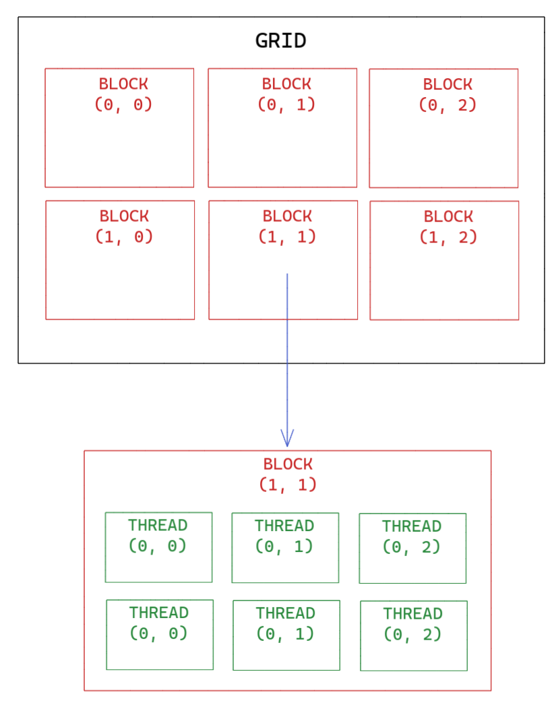

# **Workshop 10 - CUDA and hardware acceleration**

During this workshop you will learn how to use CUDA, the API developed by Nvidia to create programs that use the cores of graphics cards.

First, you will execute a Hello World on several cores of a GPU in parallel.

Then, you will develop an application able of accelerating the addition of 2 very large lists.

Finally, you will look at a bigger problem: transforming a colored image into a black and white one.

## **Step 0 - 🚀 Initialization**

A repository has been created for you when you accepted the invitation link that was sent to you by email.
Whenever you push, tests will be launched and will allow you to validate the next steps.

>🏁  **Before you begin, it is necessary that you understand a few terms.**

✔️ Understand the execution model on CUDA

✔️ Understand the memory distribution between Host and Device

✔️ Understand naming conventions on CUDA

The syntax of CUDA is very similar to C / C++.

> ⚠️ **You will find a detailed explanation [here](https://dev.to/zenulabidin/an-overview-of-cuda-part-2-host-and-device-code-69d) of the first two points**.

1. In the resources and during your research, the term used to designate the processor (CPU) as well as the classic memory (RAM) is **Host**.

2. When referring to the graphics card (GPU) as well as its memory (VRAM), the term used is **Device**.

3. In order to better organize the parallel execution of the GPU cores, called a thread, they are represented on a 3 dimensional frame.

4. Threads are grouped in blocks, which are also represented on a 3-dimensional reference frame: the Grid.

> ⚠️ **You will find a detailed explanation [here](https://en.wikipedia.org/wiki/Thread_block_(CUDA_programming)) of the last two points**.

Here is a descriptive diagram, because *a picture is worth a thousand words*, of the organization of threads in blocks in a 2 dimensional grid.

    

## **Step 1 - 👋 Hello CUDA World**

> 🚩 **First task: classic, but effective. Hello CUDA World.**

✔️ Running code using CUDA

✔️ Indexing threads

✔️ Understand the execution of a [kernel](https://developer.nvidia.com/blog/cuda-refresher-cuda-programming-model/)

To familiarize yourself with CUDA, you will start by running a function on two threads.

It should display the string `"Hello CUDA World {idx}"`, where idx is the index of the thread.

> ⚠️ ***Here are the resources you will need***:

- [Indexing on CUDA](https://docs.nvidia.com/cuda/cuda-c-programming-guide/index.html#built-in-variables).

- [Scope of functions on CUDA](https://stackoverflow.com/questions/12373940/difference-between-global-and-device-functions).

- [Launching a kernel on x blocks containing y threads](https://docs.nvidia.com/cuda/cuda-c-programming-guide/index.html#kernels).

## **Step 2 - 🔀 Summing up two arrays**

> 🚩 **Second task: add two lists, each containing 1,048,576 elements.
> The result of the addition must be contained in the second list.**

✔️ Dynamically allocate memory on a GPU

✔️ Use thread indexing in the logic of a program

✔️ Copy data from Host to Device

✔️ Copy data from Device to Host

✔️ Synchronize the execution of threads

*Your CPU goes fast, very fast, but its number of cores is limited (no more than 128 for the best).
So you will use the very large number of cores available on a GPU to speed up the execution of a program.*

> **All the steps are described in the code from the [resources](https://github.com/PoCInnovation/Workshops/blob/master/software/11.CUDA/CUDA_steps.zip) in the form of TODOs.**

> ⚠️ ***Here are the resources you will need*** :

- [The functions used to manage the memory (CTRL + F -> memc.. or mall.. 😉)](https://docs.nvidia.com/cuda/cuda-runtime-api/group__CUDART__MEMORY.html).

- [Thread synchronization](https://www.google.com/).

## **Step 3 - 🖼️ Image filter**

Congratulations, you are now comfortable with CUDA! Now, let's see a more... complicated example 😵.

> 🚩 **Task 3: Scan a color image and determine the gray value of each pixel to transform the image to black and white.**

For this last step of the workshop, a large part of the code is voluntarily given to you.
Moreover, you won't have to worry about memory!

You will have to write the body of the **`deviceKernel`** function present in the **`Image.cu`** file.

This function is responsible for the transformation of a color pixel into a black and white pixel. It takes three parameters for this:

- **`m_devicePixels`**, the list of pixels.
- **`w`**, the size on the y-axis of the image.
- **`h`**, the size on the x-axis of the image.

You must:

- Determine the number of launched threads.
- Determine the [ID](https://docs.nvidia.com/cuda/cuda-c-programming-guide/index.html#built-in-variables) of the current thread.
- Determine the number of pixels in the image.
- For a certain number of pixels, generate random values for the fields r, g and b contained between 0 and 255. Small note, the rand function does not exist on CUDA.
- Calculate the gray value of the pixel.

> ⚠️ ***Here are the resources you will need***:

- [Did you say random?](https://docs.nvidia.com/cuda/curand/index.html)

## Authors

| [ Luca Georges Francois](https://github.com/0xpanoramix)
| :---: |
<h2 align=center>
Organization
</h2>
 

    
    
    
    

    

> 🚀 Don't hesitate to follow us on our different networks, and put a star 🌟 on `PoC's` repositories.
