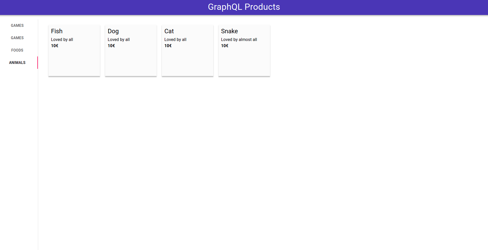

# Workshop 12 - Create a web application with GraphQL and Apollo

:heavy_check_mark: Learn graphql API concept

:heavy_check_mark: Interact with a graphQL API

:heavy_check_mark: Define your own graphql schema

:heavy_check_mark: Build a basic graphQL API

:heavy_check_mark: Use graphql in a React application

## Step 0 - Initialization

All the required information to start this workshop can be found in [SETUP.md](./SETUP.md).

## Story

Last week, your best friend told you about a great technology that allows you to create an API in just a few lines without going through the traditional architecture: GraphQL APIs.<br>
Thanks to this technology, he had fun on the public API of the World Map to make a small site about the different continents and countries.<br>
Curious by nature and looking for something new, you decide to set up your little online store project with this new technology.

## Step 1 - Welcome to GraphQl Playground

Your first reflex is to try the World Map API to play with Graphql and understand its concepts.

  - Go to [World Map API](https://countries.trevorblades.com)

Let's do some queries to retrieve data :
  - Retrieve all continents' code, name and all their countries' code, name and capital.
  - Retrieve the code, name, currency and its states' code and name of the country with `FR` code.

##### Resources

- [GraphQL syntax](https://graphql.org/learn/queries/)
- [Apollo playground](https://www.apollographql.com/docs/apollo-server/testing/graphql-playground/)

## Step 2 - Hello Apollo

It's time to try graphql, the simplest and most popular library is [Apollo server](https://github.com/apollographql/apollo-server).

### Setup backend

Create a folder named `backend` to develop your API.
Download the [source](./sources/backend.zip) and extract it in the `backend` folder.

Your directory should have the following structure :

```shell
├── prisma
│   └── schema.prisma # Database
├── src
│   ├── context.ts # Integrate database to API Context
│   ├── feeds
│   │   └── feed.ts # Feed database
│   ├── helpers
│   │   └── Errors.ts # Apollo custom errors
│   ├── resolver # All resolvers (queries and mutations)
│   │   ├── Categories
│   │   │   ├── index.ts
│   │   │   ├── mutations.ts
│   │   │   └── queries.ts
│   │   ├── Hello
│   │   │   ├── index.ts
│   │   │   ├── mutations.ts
│   │   │   └── queries.ts
│   │   ├── index.ts
│   │   └── Products
│   │       ├── index.ts
│   │       ├── mutations.ts
│   │       └── queries.ts
│   ├── schema
│   │   └── schema.graphql # GraphQL schema
│   ├── schema.ts # Compute schema and resolver
│   └── server.ts # Apollo Server
├── .eslintrc.js # Code-quality rules
├── .gitignore # Tells git which files (or patterns) it should ignored
├── .prettierrc.js # Code formatting rules
├── package.json # Package manager
├── tsconfig.json # Typescript configuration
└── yarn.lock # Dependencies file
```

To start the project, execute the following commands :

With yarn
```shell
yarn # Install dependencies
yarn migrate # Init database and prisma client
yarn dev # Start server in developer mode
```

With npm

```shell
npm install # Install dependencies
npm run migrate # Init database and prisma client
npm run dev # Start server in developer mode
```


Go to http://localhost:5000 to reach the local playground of your API.

### Basics functions

We will start with some basic function to warm up, let's write :
 - a query named `hello` that returns the `string` "Hello World"
 - a query named `personalHello` that takes a `string` as parameter and returns : "Hello " + the parameter
 - a mutation named `add` that takes two numbers as parameters and returns the additive

First, you must modify the schema in `src/schema/schema.graphql` to define your query and mutation.

Then you can define your queries and mutation in `src/resolver/Hello/` folder.

> :bulb: You can auto feed your database through the `yarn feed`.

##### Resources
  - [Apollo schema](https://www.apollographql.com/docs/tutorial/schema/)
  - [Apollo queries](https://www.apollographql.com/docs/tutorial/resolvers/)
  - [Apollo mutations](https://www.apollographql.com/docs/tutorial/mutation-resolvers/)

## Step 3 - Schema

Warm up is finished. It's time to create the schema that define our API.

The database schema is already defined in `prisma/schema.prisma`.

First, you must modify `src/schema/schema.graphql` to implement two new types :
  - `Category` that has the same fields as model `Category` in `schema.prisma`.
  - `Product` that has the same fields as model `Product` in `schema.prisma`.

Then, create resolvers that can read of `Category` and `Product` :
 - a query `categories` that return all categories
 - a query `category` takes an `id` as parameter and returns the category.
 - a query `products` that return all products
 - a query `product` takes an `id` as parameter and returns the product.

> :bulb: You can add comments that will be displayed in the playground with `"`.

You can now write `resolvers` in `src/resolver/Categories` and `src/resolver/Products`.

##### Resources
  - [Apollo schema](https://www.apollographql.com/docs/tutorial/schema/)
  - [Apollo queries](https://www.apollographql.com/docs/tutorial/resolvers/)
  - [Apollo mutations](https://www.apollographql.com/docs/tutorial/mutation-resolvers/)
  - [Prisma CRUD operation](https://www.prisma.io/docs/concepts/components/prisma-client/crud#create)

## Step 4 - CRUD

Now that you have queries to read data, it's time to modify our products and categories.

In `src/schema/schema.graphql`:

Create two `input` that defines arguments for mutation :
 - `CategoryInput`: input fields for a new category
 - `ProductInput`: input fields for a new product

:bulb: Don't forget to add fields from relation to allow connection between entities.

Add the following `Mutation` in `src/schema/schema.graphql`:
 - `createProduct` that takes an `input` of type `ProductInput` as parameter and returns the product created in the database.
 - `updateProduct` that takes an `id` and an `input` of type `ProductInput` as parameters and returns the product updated in the database.
 - `deleteProduct` that takes an `id` as parameter and returns the product deleted from the database.
 - `createCategory` that takes an `input` of type `CategoryInput` as parameter and returns the category created in the database.
 - `updateCategory` that takes an `id` and an `input` of type `CategoryInput` as parameters and returns the category updated in the database.
 - `deleteCategory` that takes an `id` as parameter and returns the category deleted from the database.

> :bulb: Don't forget to write documentation for your mutation and queries with commentaries

Your schema is defined, you can now write `resolvers` in `src/resolver/Categories` and `src/resolver/Products`.

In case of errors (e.g: a negative product price): you should use custom Apollo errors defined in `src/helpers/Errors.ts`.

##### Resources
- [Apollo schema](https://www.apollographql.com/docs/tutorial/schema/)
- [Apollo queries](https://www.apollographql.com/docs/tutorial/resolvers/)
- [Apollo mutations](https://www.apollographql.com/docs/tutorial/mutation-resolvers/)
- [Prisma CRUD operation](https://www.prisma.io/docs/concepts/components/prisma-client/crud#create)


## Step 5 - Integration with Apollo Client

Now that you have finished your API, it's time to develop your web application.

Go back to the root of the workshop's folder and create a new folder `fronted`.
Download the [source](./sources/frontend.zip) and extract it in the `frontend` folder.

Your directory should have the following structure :

```shell
├── public # Public directory with not important stuff
├── src
│   ├── api # API connection and types definition
│   │   ├── client.ts
│   │   └── Entities.ts
|   ├── app
│   │   ├── App.css
│   │   └── App.tsx # App root
|   ├── components
│   │   └── AppBar.tsx # Top Bar
│   ├── index.css
│   ├── index.tsx # Index
│   └── react-app-env.d.ts
├── .gitignore # Tells git which files (or patterns) it should ignored
├── package.json # Package manager
├── README.md # Default README.md when creating a React App
├── tsconfig.json # Typescript config
└── yarn.lock # Dependencies lock 
```

To start the project, execute the following commands :
```shell
yarn # Install dependencies
yarn start # Start server in developer mode
```

The objective is to have a simple front with a menu that shows the list of all products.
Here is an example made with the [material UI library](https://material-ui.com/) :



Create a new component `ProductsList` that lists all products existing in the database.
To do it, you must use [useQuery Apollo hook](https://www.apollographql.com/docs/react/data/queries/#executing-a-query) and React.

If you are not familiar to react, take a loot at this [documentation](https://reactjs.org/docs/getting-started.html).

##### Resources
 - [Apollo client](https://www.apollographql.com/docs/react/)
 - [React](https://reactjs.org/docs/)
 - [Functional components](https://djoech.medium.com/functional-vs-class-components-in-react-231e3fbd7108)
 - [React with Typescript](https://blog.bitsrc.io/5-strong-reasons-to-use-typescript-with-react-bc987da5d907)

## Bonus

You know how to create a GraphQL and interact with it from frontend through the `apolloClient`.

You should now implement more functionalities like :
  - User management
  - Button and forms to add products
  - Page Routing
  - A button to delete and update products
  - A button to sell and add products

## To go further

- [Auto generate your schema with Nexus](https://nexusjs.org/)
- [Mix GraphQL with Graph database though DGraph](https://dgraph.io/)
- [Integrate graphQL with Relay](https://relay.dev/)
- [Understand GraphQL security problems to avoid it](https://carvesystems.com/news/the-5-most-common-graphql-security-vulnerabilities/)

## Authors

| [<br><sub>Tom Chauveau</sub>](https://github.com/TomChv)
| :---: | 
<h2 align=center>
Organization
</h2>
<br/>
<p align='center'>
    <a href="https://www.linkedin.com/company/pocinnovation/mycompany/">
        
    </a>
    <a href="https://www.instagram.com/pocinnovation/">
        
    </a>
    <a href="https://twitter.com/PoCInnovation">
        
    </a>
    <a href="https://discord.com/invite/Yqq2ADGDS7">
        
    </a>
</p>
<p align=center>
    <a href="https://www.poc-innovation.fr/">
        
    </a>
</p>

> :rocket: Don't hesitate to follow us on our different networks, and put a star 🌟 on `PoC's` repositories.
