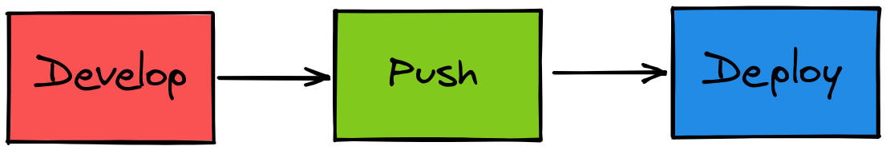

# Workshop 14 - Discover the deployment as a service with Vercel and Netlify

:heavy_check_mark: Learn how you can deploy website without cost 

:heavy_check_mark: Explore Vercel x NextJS potential  

:heavy_check_mark: Use professional tool to deploy your application

:heavy_check_mark: Build a basic REST API

:heavy_check_mark: Automate your continuous deployment

## Step 0 - Setup

All the required information to start this workshop can be found in [SETUP.md](./SETUP.md)

## Story

You are a young developer with many ideas to change the world !
The first step is to create your own website but you want to do it fast because you are young and hurry.

Your idea is simple, create a blog to show what you can do to everyone. You want to share your skill in front, backend and operational.<br>
But you got a problem, it will be boring and long to deploy all your stacks, set the ssl certificate and DNS to secure your blog etc...

Don't worry, you like challenge, you go to internet and search some tools to easily set an environment and deploy your application.
You see that [Vercel](https://vercel.com/) or [Netlify](https://www.netlify.com/) can be really cool to achieve your objective.

In this workshop, we will explore the power of CD as services. Here is a schema of the functioning of those services




## Step 1 - Quick start

The objective is to deploy your own blog on [Netlify](https://www.netlify.com/) or [Vercel](https://vercel.com/), here is a really basic [example](https://blissful-dijkstra-a9097f.netlify.app/) of blog with some articles.

> :warning: The primary objective is to discover the power of those platform, don't judge the design.

For this workshop, we are going to use [Vercel](https://vercel.com/) because it has a perfect integration with [NextJS](https://nextjs.org/).

Let's start a simple Next project.

- Go to [Vercel](https://vercel.com/)
- Create an account
- Link your [Github](https://github.com/) account
- Create a new project with **NextJS** template
- Wait until your project is deployed

> :bulb: There are many templates available [here](https://github.com/vercel/next.js/tree/master/examples)

Your project is now deployed online.

Now, `clone` the Github repository in your computer.

It should have the following architecture :

```shell
.
├── pages              # Javascript source code
│  ├── api
│  │ └── hello.js      # Simple backend route
│  ├── _app.js         # Component
│  └── index.js        # Index
├── public             # Assets
│  ├── favicon.ico 
│  └── vercel.svg
├── styles             # Styles
│  ├── globals.css
│  └── Home.module.css
├── .eslintrc.json     # Code-quality rules
├── .gitignore         # Tells git which files (or patterns) it should ignored
├── next.config.js     # Next JS config
├── package-lock.json  # Dependencies manager
├── package.json       # Package manager
└── README.md          # Starter help          
```

Thanks [NextJS](https://nextjs.org/) we can both develop the frontend and the backend of our application.

You must install dependencies :

Yarn : `yarn`<br>
Npm:   `npm install`

## Step 2 - Serverless functions

To design our blog, first we will need a backend to store our posts.

First, let's write a simple route to understand how [NextJS](https://nextjs.org/) and [Vercel](https://vercel.com/) work with [serverless functions](https://vercel.com/docs/serverless-functions/introduction).

> NextJS can create an endpoint from a file, for example : you can actually reach the endpoint `<your_website>/api/hello> in your project.

#### Ping

In `api` folder, create a file `ping.js` that will just respond `pong` when you hit the endpoint.

> :bulb: You should take as example the file `hello.js`.

> You can run your project with `yarn dev` or `npm run dev`.

If you've done everything good, you should reach your endpoint through `http://localhost:3000/api/ping`. The command below should print `Success`.

```shell
curl -s http://localhost:3000/api/ping | grep "pong" > /dev/null && echo "Success" || echo "Fail"
```

#### Hello dude !

Now the objective is simple : use an url parameter to say hello with a [dynamic api route](https://nextjs.org/docs/api-routes/dynamic-api-routes).

Create a folder `hello` and a file named `[name].js` in this folder.

It must :
- Retrieve the name in the `url parameter`
- Response with the string `Hello <parameter> !`.

The command below should print `Success`

> :bulb: Next will automatically reload your application, you don't need to restart your server.

```shell
curl -s http://localhost:3000/api/hello/John | grep "Hello John \!" > /dev/null && echo "Success" || echo "Fail"
```

#### Deploy

You had some fun with Next backend, it's time to deploy your changes in public with Vercel ! 

To do it, just `push` your code, it should reload your application.

Go to your [dashboard](https://vercel.com/dashboard) and click on the `Visit` button to reach your website.

You can now play with the `url` to test your backend. Try to share your url with your friend, they can also test your application.

## Step 3 - Post posts

It's time to create our backend to manage your post.

Your post must be represented like the following object :
```json
{
  "id": "the post id",
  "title": "A title",
  "content": "My content",
  "created_at": "Date of creation"
}
```

Originally, you should store your data in a [database](https://en.wikipedia.org/wiki/Database) but it would be long so we will just store it.<br>
Create a file named `resources.js` that export a variable that store data in an array named `posts`.

Create a file `posts.js` in `api` that will be our [REST endpoint](https://www.sitepoint.com/rest-api/) to manage posts.

It must :
- On **GET** : Retrieve all posts stored in the API
- On **POST** : Create a new post
  - The **body** of your request must have a `title` and a `content`, you can generate the `created_at` with `Date`.
    
> You can retrieve the body with `req.body`.

:rocket: Now, you can create a folder `posts` that get an `id` as `url parameter` to do :
- On **GET** : Retrieve the post identified by its `id`
- On **PUT** : Update post data
- On **DELETE** : Delete the post

> :bulb: You can use [Postman](https://www.postman.com/) to test your API.
>
> :bulb: You should create some `fake datas` to easily feed your frontend during next steps

#### Deploy

You can now deploy your App on Vercel to update your application.

## Step 4 - The page is the soul's mirror

Now you got your backend, let's create the frontend !

To begin with, we will create the top bar to discover [next syntax](https://nextjs.org/docs/basic-features/pages).

Take a look at a `next frontend architecture` :

```shell
├── pages
│  ├── api
│  │ └── # your API
│  ├── _app.js    # Component
│  └── index.js   # Index
├── public        # Public assets
│  ├── favicon.ico 
│  └── vercel.svg
├── styles             # Styles (CSS) directory
│  ├── globals.css     # Global CSS style
│  └── Home.module.css # Style scoped for Home component
```

Now, to create the top bar we need 2 things: a component named `TopBar` wrote in a `TopBar.js` and a `stylesheet` named `TopBar.module.css`.

Here we go, first :

- Create a file named `TopBar.js` that will export a component that display a topBar.

> You can `return` simple html, it's not different from vanilla html for the moment.

- Create a stylesheet named `TopBar.module.css` that will apply some style to our component (e.g: position, size, colors, font-size...).

- Now you must display it to your website, go to `index.js` and remove all the code in the `return`, replace it with your component, you can use it like a html tag (e.g: `<TopBar/>`). 

Push your work and share your `website url` to your friends, so they can be impressed by your skills :rocket:

## Step 5 - Look posts

It's time to retrieve your posts and share it with the rest of the world.

To do it, you know the recipe, just create a new component named `Posts` and a `stylesheet` named `Posts.module.css`.

You will also need to fetch your data from your API. This [documentation](https://nextjs.org/docs/basic-features/data-fetching) can help you to do it.

> :bulb: To fetch your **properties**, you should use [axios](https://www.npmjs.com/package/axios) and that [example](https://github.com/vercel/next.js/blob/canary/examples/with-custom-reverse-proxy/pages/index.js#L5).

> :bulb: Thanks NextJS integration, you don't need to care about [CORS](https://en.wikipedia.org/wiki/Cross-origin_resource_sharing).

Now you can publish your beautiful blog online and share it with your friends !

## Further steps

Now that you got the list of your posts. You should add a new `button` that will trigger a forms to add component.

You could also provide a little red cross that will delete the note when you click on it. It's up to you to customize your blog.

## Bonus

You are now an expert of deployment as a service. Why don't you try other websites like [Netlify](https://www.netlify.com/).

Deploy a new website in this platform, it's really easy.

Here's steps to deploy on Netlify :
- Create a git repository
- Sign-in on [Netlify](https://www.netlify.com/)
- Go to `New site from Git`
- Choose your repository
- Push `Deploy`
- It's done, your website is now online :rocket:

## Go Further

- [Github pages](https://pages.github.com/)
- [What is JamStack](https://jamstatic.fr/2019/02/07/c-est-quoi-la-jamstack/)
- [Next GraphQL](https://github.com/vercel/next.js/tree/canary/examples/api-routes-graphql)
- [Next Configuration](https://nextjs.org/docs/api-reference/next.config.js/introduction)
- [Next Crud](https://next-crud.js.org/)
- [Next Typescript](https://nextjs.org/docs/basic-features/typescript)

## Authors

| [<br><sub>Tom Chauveau</sub>](https://github.com/TomChv) | [<br><sub>Adrien Fort</sub>](https://github.com/adrienfort) 
| :---: | :---: |
<h2 align=center>
Organization
</h2>
<br/>
<p align='center'>
    <a href="https://www.linkedin.com/company/pocinnovation/mycompany/">
        
    </a>
    <a href="https://www.instagram.com/pocinnovation/">
        
    </a>
    <a href="https://twitter.com/PoCInnovation">
        
    </a>
    <a href="https://discord.com/invite/Yqq2ADGDS7">
        
    </a>
</p>
<p align=center>
    <a href="https://www.poc-innovation.fr/">
        
    </a>
</p>

> :rocket: Don't hesitate to follow us on our different networks, and put a star 🌟 on `PoC's` repositories.
