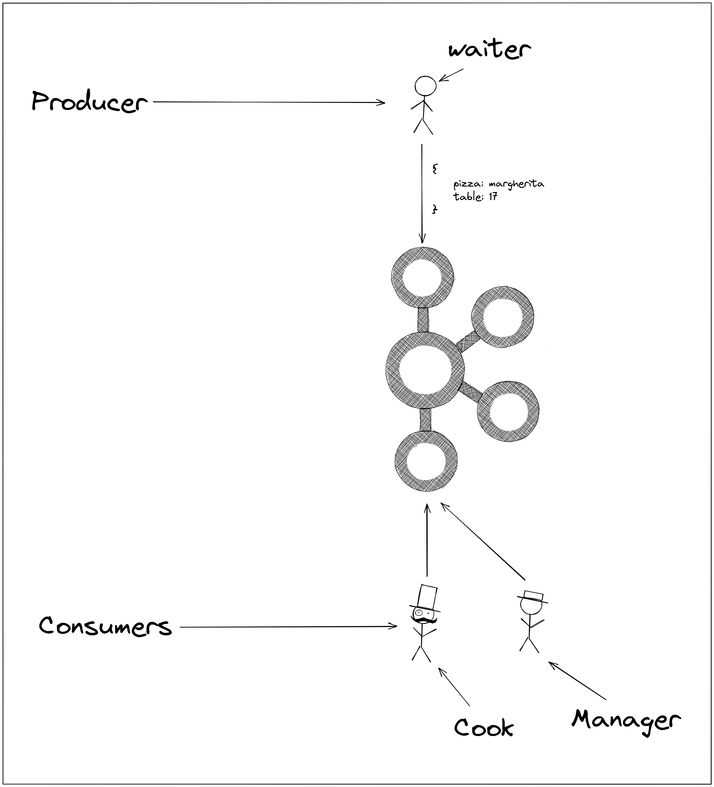

# Workshop 18 - Setup Kafka in a microservice architecture

✔️ Start Kafka and ZooKeeper using docker compose

✔️ Create a producer service

✔️ Create two consumer services

✔️ Publish messages into Kafka

## Introduction

> What am I going to do during this workshop ?

You will create a microservice architecture enhanced by [Kafka](https://kafka.apache.org/).

Take a look at the schema below:



Let's describe the situation:
- The waiter asks the kitchen to prepare a pizza of type [margherita](https://www.marmiton.org/recettes/recette_la-pizza-margherita-recette-realisable-a-la-maison_335446.aspx) for table 17
- Since this restaurant has a lot of orders, you'll help them scale up using Kafka
- Once the order has been published into Kafka, two consumers will consume this order
- The cook will prepare the order
- The manager keeps track of the orders and record it in a file (like a database)

> But what *is* Kafka ? What do I need this anyway ?

Kafka is a [message broker](https://www.ibm.com/cloud/learn/message-brokers), meaning that someone is responsible for sending messages to Kafka - the producer - and someone else will receive these messages - the consumer.
Other message brokers exists, like [RabbitMQ](https://www.rabbitmq.com/), but Kafka is much more resilient, because it is designed to support stream interruptions.

I'm not going to lie, Kafka is a bit overkill for this workshop.
Well it is still a good way to learn its behavior and how to interact with Kafka using your own producer / consumer.

At the end of the workshop, you'll be able to scale up even further this application with more producers / consumers.

## Step 0 - Setup

Please follow the instructions available [here](./SETUP.md).

## Step 1 - Start Kafka and ZooKeeper

### 📑 **Description**:
You'll need to start Kafka in a docker container, but Kafka actually relies on [ZooKeeper](http://cloudurable.com/blog/kafka-architecture/index.html).

Those services will start into docker containers.

### 📌 **Tasks**:
- Create a `docker-compose.yaml` file

In this file, create a `zookeeper` service:
- It uses the following docker image: [`confluentinc/cp-zookeeper:latest`](https://hub.docker.com/r/confluentinc/cp-zookeeper)
- It binds the container port `22181` to your local `22181` port
- [Initialize the required environment variables](https://docs.confluent.io/platform/current/installation/docker/config-reference.html#zk-configuration)

Then, create a second service, named `kafka`:
- It uses the following docker image: [`confluentinc/cp-kafka:latest`](https://hub.docker.com/r/confluentinc/cp-kafka/)
- It binds the following container ports to your local ports:
  - 19092 to 19092, the internal listener
  - 19091 to 19091, the external listener
- [Initialize the required environment variables](https://docs.confluent.io/platform/current/installation/docker/config-reference.html#confluent-ak-configuration)
- It depends on the `zookeeper` service

> You'll have to setup non-required environment variables, look for the listeners related ones !

### 📚 **Documentation**:

- [Control startup and shutdown order in docker compose](https://docs.docker.com/compose/startup-order/)
- [Kafka listeners explained](https://www.confluent.io/blog/kafka-listeners-explained/)
- [Kafka configuration properties](https://jaceklaskowski.gitbooks.io/apache-kafka/content/kafka-properties.html)

### ✔️ **Validation**:

Run `docker-compose up --build -d`, wait 30 seconds and in a new terminal run `docker-compose logs kafka | grep -i 
started`. 
It should print:
```shell
$ docker-compose logs kafka | grep -i started
kafka_1      | [2021-08-08 14:06:44,854] DEBUG [ReplicaStateMachine controllerId=1002] Started replica state machine with initial state -> HashMap() (kafka.controller.ZkReplicaStateMachine)
kafka_1      | [2021-08-08 14:06:44,856] DEBUG [PartitionStateMachine controllerId=1002] Started partition state machine with initial state -> HashMap() (kafka.controller.ZkPartitionStateMachine)
kafka_1      | [2021-08-08 14:06:44,866] INFO [SocketServer listenerType=ZK_BROKER, nodeId=1002] Started data-plane acceptor and processor(s) for endpoint : ListenerName(LISTENER_IN) (kafka.network.SocketServer)
kafka_1      | [2021-08-08 14:06:44,867] INFO [SocketServer listenerType=ZK_BROKER, nodeId=1002] Started data-plane acceptor and processor(s) for endpoint : ListenerName(LISTENER_OUT) (kafka.network.SocketServer)
kafka_1      | [2021-08-08 14:06:44,867] INFO [SocketServer listenerType=ZK_BROKER, nodeId=1002] Started socket server acceptors and processors (kafka.network.SocketServer)
kafka_1      | [2021-08-08 14:06:44,872] INFO [KafkaServer id=1002] started (kafka.server.KafkaServer)
kafka_1      | [2021-08-08 14:10:13,068] DEBUG [ReplicaStateMachine controllerId=1002] Started replica state machine with initial state -> HashMap() (kafka.controller.ZkReplicaStateMachine)
kafka_1      | [2021-08-08 14:10:13,070] DEBUG [PartitionStateMachine controllerId=1002] Started partition state machine with initial state -> HashMap() (kafka.controller.ZkPartitionStateMachine)
kafka_1      | [2021-08-08 14:10:13,099] INFO [SocketServer listenerType=ZK_BROKER, nodeId=1002] Started data-plane acceptor and processor(s) for endpoint : ListenerName(LISTENER_IN) (kafka.network.SocketServer)
kafka_1      | [2021-08-08 14:10:13,100] INFO [SocketServer listenerType=ZK_BROKER, nodeId=1002] Started data-plane acceptor and processor(s) for endpoint : ListenerName(LISTENER_OUT) (kafka.network.SocketServer)
kafka_1      | [2021-08-08 14:10:13,100] INFO [SocketServer listenerType=ZK_BROKER, nodeId=1002] Started socket server acceptors and processors (kafka.network.SocketServer)
kafka_1      | [2021-08-08 14:10:13,104] INFO [KafkaServer id=1002] started (kafka.server.KafkaServer)
```

## Step 2 - Creating the producer

### 📑 **Description**:
In this step, you will create a service responsible for publishing messages into Kafka.

You'll use the [Go programming language](https://golang.org/), and the package [sarama](https://github.com/Shopify/sarama) to create the producer.

### 📌 **Tasks**:
- Create a `client` folder and jump into it
- Initialize the go module with the following command: `go mod init waiter`
- Install sarama with `go get github.com/Shopify/sarama`
- Create a `main.go` file
- Create 3 functions:
  - The `main` one
  - `createProducer` which will create the producer and connect to the Kafka broker
  - `publishOrder` which will publish a pizza order
- The message that the producer will publish must be of the type `Order`, a [structure](https://gobyexample.com/structs) containing a `string` - the 
  pizza 
  type - and an int - the table that ordered the pizza
- It must be published on the `pizza-order` topic
- You'll then call the two last functions in the `main` one
- Once the message has been published, print the partition and the offset it has been published to 

### 📚 **Documentation**:
- [How to send message from any type ? Use bytes](https://pkg.go.dev/github.com/sclasen/sarama#ByteEncoder)
- [Sarama documentation](https://pkg.go.dev/github.com/sclasen/sarama#section-documentation)

### ✔️ **Validation**:

Run the following command while your Kafka cluster is running:
```shell
go run main.go
```

It should print the following:
```shell
go run main.go
message published on partition 0 with offset 0
```

And if you run it a second time:
```shell
go run main.go
message published on partition `0` with offset `1`
```

## Step 3 - Creating the first consumer - the cook

### 📑 **Description**:

It's now time for you to create the first consumer: the cooks in your kitchen !

First, you will create the actual consumer and then consume messages.

### 📌 **Tasks**:
- Create a `kitchen` folder and jump in it
- Once again, initialize the go module using `go mo init kitchen`
- Install sarama using `go get github.com/Shopify/sarama`
- Create a `main.go` file and open it
- Create 3 functions:
  - The `main` one
  - `createConsumer` which creates the consumer using sarama
  - `consumeMessages` which retrieves the partitions, and then read for the incoming messages as they arrive and 
    print their content after decoding them

### 📚 **Documentation**:
- [Consumer with Sarama](https://pkg.go.dev/github.com/Shopify/sarama#ConsumerGroup)
- [How to consume partitions ?](https://pkg.go.dev/github.com/Shopify/sarama#Consumer)

### ✔️ **Validation**:
Start your Kafka cluster using `docker-compose up --build`.

Then, start the consumer in a new terminal using `go run main.go` in the `kitchen` folder.

Finally, start the producer in a new terminal using `go run main.go` in the `client` folder.

You should see the following in the consumer's terminal:
```shell
go run main.go
Received an order for a pizza margherita at table 17 !
```

## Step 4 - Creating the second consumer - the manager

### 📑 **Description**:
This service act as a storage / monitoring for the incoming orders.
It will save the incoming orders in a file.

We split the kitchen and manager service to improve the single-responsibility feature of each service.

### 📌 **Tasks**:
- You already did one consumer right ? Now just save the result in a file named `log.txt` :)
- Create it in the `manager` folder

### 📚 **Documentation**:
- [Working with files](https://gobyexample.com/writing-files)

### ✔️ **Validation**:
Use the same commands as in the previous step, and start the new consumer in the `manager` folder using `go run main.go`.

It should have created a file named `log.txt` with the following sentence inside: `Received an order for a pizza margherita at table 17 !`.

## To go further
- Improve the services: dockerize your producer and consumers !

- Improve the producer
  - Split functions into separate folders
  - Take the pizza type, and the table as command line arguments
  - Take a configuration file as pizza orders

## Authors

| [<br><sub>Luca Georges Francois</sub>](https://github.com/0xpanoramix) | 
| :---: |
<h2 align=center>
Organization
</h2>
<br/>
<p align='center'>
    <a href="https://www.linkedin.com/company/pocinnovation/mycompany/">
        
    </a>
    <a href="https://www.instagram.com/pocinnovation/">
        
    </a>
    <a href="https://twitter.com/PoCInnovation">
        
    </a>
    <a href="https://discord.com/invite/Yqq2ADGDS7">
        
    </a>
</p>
<p align=center>
    <a href="https://www.poc-innovation.fr/">
        
    </a>
</p>

> 🚀 Don't hesitate to follow us on our different networks, and put a star 🌟 on `PoC's` repositories.
