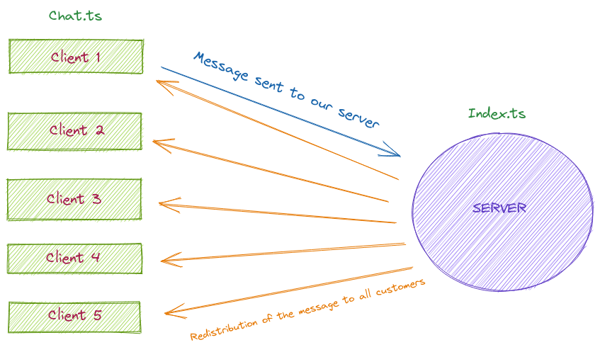

# Workshop 19 - Chat with Socket.IO

:heavy_check_mark: Learn Typescript fundamental 
:heavy_check_mark: Work with socket and http servers 
:heavy_check_mark: Understand sockets 
:heavy_check_mark: Understand how transmits data 

## Story

The schema below shows the architecture of the online chat:

**Explanation**
Each client represents an HTML page. 
As soon as a client sends a message, it is transmitted as a socket to the backend. 
The backend retrieves the socket and sends it to all clients as a socket. 
The content of the message is then displayed on the HTML page of all clients. 
We will then display the message on our frontend. 

- [What's a socket ?](https://socket.io/docs/v4/index.html)

## Step 0 - Setup

All the required information to start this workshop can be found in [SETUP.md](./SETUP.md).

Be careful to finish every step before moving one to the next thing.

If you are new to Typescript, you should check our [Typescript cheatsheet](https://github.com/PoCInnovation/Workshops/blob/master/software/8.Typescript/HELP.md).

## Step 01 - Link your HTML page

Your first step is to modify the content of your '/' routes
in order to have your html page on your route.

In the file `src/router/router.ts`
- import [path](https://nodejs.org/docs/latest/api/path.html)
- replace `Hello World` by your HTML page's path define in `src/Front/index.html`.

If your reload your browser page, you should see the input and button `Send`.

#### Resources
- [Set path](https://www.codegrepper.com/code-examples/html/express+sendFile)

## Step 02 - Create Socket Server

First, you can find an  [express](https://expressjs.com/fr/) server in `src/index.ts`. 
You need to change this file to both use express and socket.io. 
That will allow you to issue and receive data on your server.

First, import all packages required to do the step:
- [socket.io](https://www.npmjs.com/package/socket.io).
- [http](https://nodejs.dev/learn/the-nodejs-http-module).
- [path](https://nodejs.dev/learn/the-nodejs-path-module).

Then, we will add the `socket server` to our `express`:
- Create a new server using `http` package with your old express `app` as arguments
- Create a new `io` server that listens to your HTTP server.
- Replace the `start` method of your server with `listen`
> :bulb: Your server must listen to port `8080`

If you don't have any errors in your terminal, and you have your browser on your HTML page, let's go to the next step!
#### Resources
- [Variable Typescript](https://www.typescriptlang.org/docs/handbook/variable-declarations.html)
- [Server Socket.IO](https://socket.io/get-started/chat)
- [Link HTML](https://www.techiediaries.com/express-sendfile-serve-static-files/)
- [Http_Server](https://nodejs.org/en/docs/guides/anatomy-of-an-http-transaction/)

## Step 03 - Set Connection

On every user's connection, we will [log a message in our shell](https://developer.mozilla.org/fr/docs/Web/API/Console/log).

- Create an event `connection` with `socket` as parameter.
- Inside you must log `[INFO] New user connected`.
- Uncomment the line `express_server.app.use(express.static(path.join(__dirname, 'front'));`
to connect frontend to backend. 
This way you can emit and receive sockets between them.

[If you open and close your browser page](http://localhost:8080/) you should see logs on your terminal.

#### Resources
- [Introduction Socket.IO](https://socket.io/docs/v4/index.html)
- [Socket.IO](https://socket.io/)

## Step 04 - Transmission Data

You have established connection !

It's time to implement a method to send messages from your frontend to your backend.

Now, complete the Class `Chat` in `src/front/chat.ts`  :
- Create a method `emit_data` with a `message` of type `string` as parameter.
- Emit socket with your event named `data` and your `message`.
- In `index.ts` you must receive the information from the `data` event log the `message`.
- Call your `emit method` in `chat.ts` with `Hello World !` as message.

> :bulb: Take your time to read the documentation.

In your terminal you should see `Hello World !` logged.

#### Resources
- [Typescript Class](https://www.typescriptlang.org/docs/handbook/2/classes.html)
- [Log message](https://www.typescriptlang.org/docs/handbook/typescript-from-scratch.html)
- [Emit Socket](https://socket.io/docs/v3/emit-cheatsheet/index.html)
- [Socket Server](https://k6.io/docs/javascript-api/k6-ws/socket/socket-on-event-callback/)

## Step 05 - Get Browser Data

Now that we retrieved the data, we will send it from our server to our fronted.

The objective of this step is to know when the user presses the button on the html page. 
At this point you will log the content of the input into your terminal.

It's time to get information from your input.

##### Retrieve html input components

In `chat.ts`, you will create two constants variables:
- `form_data`: get element `form` by his id on your html page.
- `input_data`: get element `input` by his id on your html page.

##### Send message
- Make your button listen to the event `submit` .
- Create a `message` variable to store the data from your input.
- Log the content.
- Call `emit_data` to send the `message`.
- Update input's value to an empty string.

> :bulb: To get value from `data_input`, cast your variable to `HTMLInputElement`.
>
> :warning: It's necessary to always update the input value with an empty string to doesn't keep the previous value. 

You should see the message logged in your terminal after you have clicked the button `Send`

#### Resources
- [Socket listener](https://socket.io/docs/v4/index.html)
- [Cast Variable](https://www.typescripttutorial.net/typescript-tutorial/type-casting/)

## Step 06 - Print Data in Your Browser Console

See our message on our shell is cool but see our message in our browser's console is better.

In your backend, change the way of sockets' sending to send the received message to **everyone**.

- Change your `socket.emit` in `index.ts` to send `socket` to all clients in the current namespace __except to the sender__.

Now, if you submit a message and look to the browser's console: you should see your message.

#### Resources
- [Socket Client](https://socket.io/docs/v4/client-socket-instance/)
- [Type of emit Socket](https://socket.io/docs/v3/emit-cheatsheet/index.html)

## Step 07 - Print Data in your Browser Html Page

Now we will create a new method in our `Chat` class to add the content of our input into our div.
This will allow us to see the messages directly in our HTML page.

To do this, we will create a method `append_data` in our class `Chat`.
First, create a constant variable:
- `html_page`: get element by his id of you `div`, his id should be is `messages`.

Second, in your method `append_data`:
- Create a variable `add_element` that should create an element `div`.
- Display the message gave as parameter in this new div.
- Append the `div` to your variable `html_page`.

Finally, call this method in the `emit_data`.

If you send a message, you should see it in your HTML page !!!
Congratulation !

#### Resources
- [Release a socket](https://socket.io/docs/v3/emit-cheatsheet/index.html)
- [Request HTML](https://developer.mozilla.org/en-US/docs/Web/API/Element/querySelector)
- [Socket Client](https://socket.io/docs/v4/client-socket-instance/)

## Step 08 - Get username

We will now retrieve the name of each user when they connect.

You will need to:
- Create a variable `my_name` that retrieves the username through a [prompt](https://wprock.fr/blog/javascript-boites-dialogue-alert-confirm-prompt/) that says `What is your name?`.
- Just bellow, display `New user + name` with the username, when a user connects to the page.

#### Resources
[Set Name Variable](https://www.dummies.com/web-design-development/javascript/how-to-prompt-the-user-for-input-in-javascript/)

## Step 09 - Set Username

We are going to emit a socket triggered when a user connects with his name as parameter. 
This event will be sent to our server which will send back a socket to our frontend to display a connection message.

In `chat.ts`, we will:
- Create an event `new_user` with `my_name` as parameter.
- Create a listening socket named `user_connect` with a `string` as a parameter.
- Inside the socket, call `emit_data` with the string `Connect + name` where `name` is the parameter.

In the `index.ts` we will:
- Create a listening socket named `new_user` with a `string` as a parameter.
- Inside it, display in your terminal `New user + name` where `name` is the parameter.
- emit socket to all users with an `user-connect` event and `name` as parameters.

In `chat.ts`, add the name of your client before the message.
You must change the value of the print when you add a div.

When you log in, you should see `New User + your_name`.

## Step 10 - Manage Message

The final touch is to add the name of each user before the message is sent.

In `chat.ts`, add the name of the client before the message.
- Change the value of the display when you add the content of the input into your div.

:bulb: **Example**: `name: message`.

If you send messages on your HTML page you should see the username before the message.

Congratulation you have an online chat !

## Bonus

* Set connection and disconnect.
* Create rooms that allow you to send a message to every user that is in the same room.
* Improve your fronted with React.
* Authentication of the user with socket.
* Add a database to store messages and refresh when there is a connection.

#### Resources
- [React](https://reactjs.org/)
- [Room Socket](https://socket.io/docs/v3/rooms/index.html)
- [Authentication Socket](https://socket.io/docs/v3/middlewares/)

## Authors
- [Albert VALENTIN](https://github.com/OnsagerHe)

Made with :heart: by PoC.

## Organization

- [📒 Linkedin](https://www.linkedin.com/company/pocinnovation/mycompany/)
- [📷 Instagram](https://www.instagram.com/pocinnovation/)
- [🖱️ Website](https://www.poc-innovation.fr/)
- [🌐 Discord](https://discord.gg/Yqq2ADGDS7)

> :rocket: Don't hesitate to follow us on our different networks, and put a star 🌟 on `PoC's` repositories.
