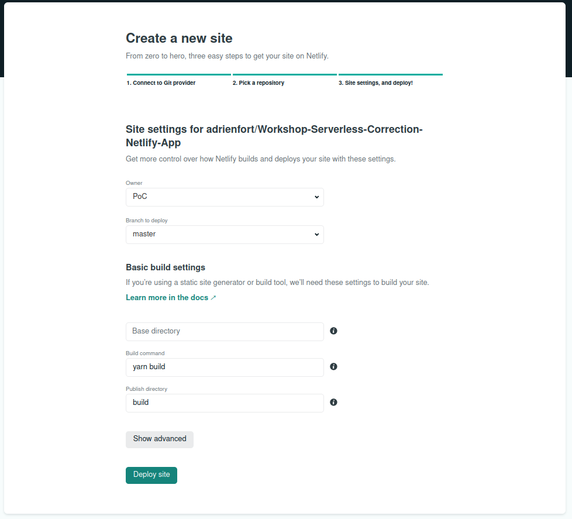
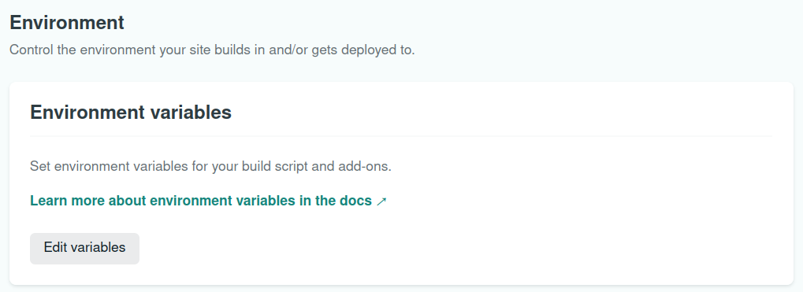

# Workshop Serverless ✨
Learn the basics of Serverless, an architecture helping you saving time and money.
##### ✔️ Serverless App using [Netlify](https://www.netlify.com/), [React](https://fr.reactjs.org/) TS and [Chakra UI](https://chakra-ui.com/)
##### ✔️ Serverless API using [Serverless Framework](https://www.serverless.com/)

## Introduction 🔰
- You want to stay focus on your code, forget about setting-up severs ?  
- You want to have a scalable application without doing anything ?  
- You want to pay for what you use ?  
- You don't even know what is serverless ?  

#### Well, you are in the right place at the right time 🍀

## Step 0: Setup
Watch [this video](https://www.youtube.com/watch?v=tgFiOzVEL0Q) 👀 and please follow the steps in the [SETUP.md](./SETUP.md)  
**Done ? You are now ready to go ! 🔥**

## Step 1: Build your app
(Code inside your Serverless Gifs App repository)  
Click [here](https://eager-albattani-482adb.netlify.app/) to see an example of what you can do 👀  
**For now, you will call the giphy API inside the project** 
#### Usefull links:
- [React State Hook](https://fr.reactjs.org/docs/hooks-state.html)
- [React Effect Hook](https://fr.reactjs.org/docs/hooks-effect.html)
- [Chakra UI](https://chakra-ui.com/)
- [iframe](https://developer.mozilla.org/fr/docs/Web/HTML/Element/iframe)

**If you've never learn react, live coding ! 🎥**

## Step 2: Deploy your app
#### Follow these steps:
> First, push your work on Github
- Commit and push your work

> Then you will deploy your application on Netlify
- Go to your [Netlify](https://www.netlify.com/) account, `Team overview` and click the `New site from Git` button
  

    
See the button

  
   

  

- Select Github for Continious Deployment
  

    
See the button

  
   

  

- Choose your Serverless Gifs App repository
- Deploy your application with de default settings   
  **Attention: be aware to the branch to deploy: select your default repository branch**
  

    
See the default settings

  
   

  

> Good ! Your application is now deployed ! But if you try to use it, we can see that it doesn't work 🤔   
> Can you guess what the problem is ?  
> Well, you haven't setup your environment variables !  
> Lets do it ⤵️
- Go to "Site Settings", then "Build and deploy", scroll to the bottom. You will see an "Environment" section
- Click the "Edit variables" button
  

    
See the button

  
   

  

- Add your REACT_APP_GIPHY_API_KEY environment variable and SAVE
- Go to "Deploys", click the "Trigger Deploy" button and select "Deploy Site"
  

    
See the button

  
   

  

**Your application is now working on production !! 🔥🔥 You can share it 😎**  

## Step 3: Create your first serverless function
#### Usefull link:
- [Netlify Serverless Functions](https://docs.netlify.com/functions/overview/)

Once you're done, just push your work on your default branch. Netlify will automatically detect changes and will deploy your application.
**Amazing 🎆, isn't it ?**

## Step 4: Create your first serverless API
#### Follow these steps:
- TODO

## Bonus: 
- #### Create a frontend project calling your serverless API
- #### Deploy your API with [scaleway](https://www.scaleway.com/en/docs/scaleway-elements-serverless-getting-started/)
  Why scaleway ? Because there are 🇫🇷 !
- #### Restart steps 1/2/3, with another API than Giphy

## Author
- [Adrien Fort](https://github.com/adrienfort)
