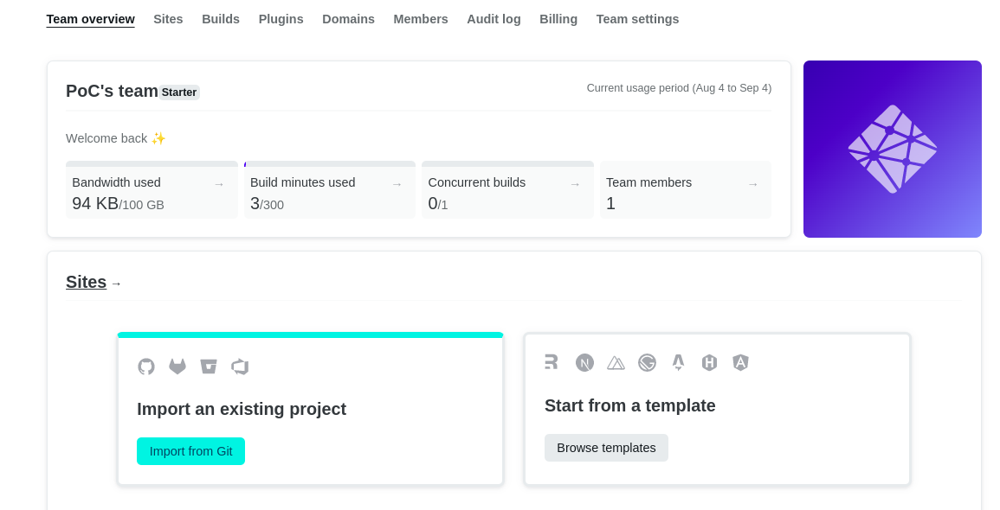

# Workshop 21 - Serverless ✨

✔️ Learn the basics of Serverless, an architecture helping you save time and money.

✔️ Create a serverless App using [Netlify](https://www.netlify.com/), [React](https://fr.reactjs.org/) TS and [Chakra UI](https://chakra-ui.com/)

✔️ Create a serverless API using the [Serverless Framework](https://www.serverless.com/)  

## Introduction 🔰

**What you will do and why:**  
Let's say you want to build an application. One of the things you need to think about is **servers**. Sometimes there is high traffic, sometimes low traffic. You want to handle it, so you have two options (for now):  
- Pay for a lot of server resources so that even in high traffic your server can handle it.
But during low traffic, you will pay for these resources too. That's not a good thing because you don't **pay for what you use**.  
- Have **scalable** servers. It means that you allocate the right resources depending on your traffic. To create this process, you can use [kubernetes](https://kubernetes.io/fr/docs/concepts/overview/what-is-kubernetes/). If you want to learn it, [here is our workshop](https://github.com/PoCInnovation/Workshops/tree/master/software/20.Kubernetes)  
  
However, this second solution is something very long to implement and maintain.
This is problematic if you just want to stay focus on your code and don't want to care about server management.  
Well, you have a third option: adopt a **serverless architecture**.  
  
**But what is serverless architecture ?**  
When you build an API to link your frontend with your database for example, you usually run it on a server. This means that a server is allocated and listen to the queries to this API.  
  
Using a serverless architecture, it's different.  
  
You don't allocate a specific server listening on queries to your API. You just choose a cloud provider ([aws](https://aws.amazon.com/fr/), [scaleway](https://www.scaleway.com/en/), ...), and you give it your API's functions, one by one. They will be called **serverless functions**.  
> 💡 You don't give the whole API to a server ! You just give to the cloud provider your functions one by one.  
  
Consequently, when a query is made to call the API, it will create a container on a cloud provider's server and run the function inside.  
The benefits are the following: 
- The cloud provider creates as many containers as needed, so you have a scalable API.
- You pay for what you use, which is the number of containers created.
- All that without the headache of implementing a server setup. You just give to the cloud provider your functions, it handles the rest.

**It's very useful ... but not always !**  
It depends on what you want to do ⚠️  
In fact, there are some drawbacks to use a serverless architecture.  
First, a serverless function has a limit of [15 minutes of running](https://aws.amazon.com/about-aws/whats-new/2018/10/aws-lambda-supports-functions-that-can-run-up-to-15-minutes/). So you can't build a game using a serverless architecture.  
Then, a serverless function needs sometimes a cold start before running. Depending on the cloud provider you will use, you can lose up to 4 seconds !
> A [cold start](https://mikhail.io/serverless/coldstarts/big3/) happens when the serverless function hasn't been running for a defined period (depending on the cloud provider). As a consequence, a container (in which the function will be executed) needs to be created.

The **perfect scenario** is the following:  
You have an application where all functions are relatively short (0-15 mins) and are called regularly by the users. In this case, adopting a serverless architecture is awesome because you pay for what you use, and you stay focus on your code.  
  
For more explanations, you can watch [this video](https://www.youtube.com/watch?v=tgFiOzVEL0Q) 👀

## Step 0 - Setup

Please follow the steps in the [SETUP.md](./SETUP.md)  
**Done ? You are now ready to go ! 🔥**

## Step 1 - Code your app

In this step you will code a simple serverless gifs app using [React](https://reactjs.org/) TS and [Chakra UI](https://chakra-ui.com/), in which you display gifs depending on the user's input. For this you will need to [fetch](https://developer.mozilla.org/fr/docs/Web/API/Fetch_API/Using_Fetch) the [Giphy API](https://developers.giphy.com/explorer#explorer).

- Go to your Serverless Gifs App repository with `cd [YOUR GIFS REPO NAME]`  
- Code your app
 > 💡 You will need a [form](https://reactjs.org/docs/forms.html), with an [input](https://chakra-ui.com/docs/form/input), and a submit [button](https://chakra-ui.com/docs/form/button)

> For now, just call the Giphy API inside the frontend of your project

> You can display the GIFs using the [iframe](https://developer.mozilla.org/fr/docs/Web/HTML/Element/iframe) element

[Click to see an example of what you can do](https://eager-albattani-482adb.netlify.app/) 👀  
  
**Useful links:**
- [React general tutorial](https://reactjs.org/tutorial/tutorial.html#what-is-react)
- [React State Hook](https://reactjs.org/docs/hooks-state.html)
- [React Effect Hook](https://reactjs.org/docs/hooks-effect.html)
- [Chakra UI](https://chakra-ui.com/)
- [Giphy API documentation](https://developers.giphy.com/explorer#explorer)
  > We advise you to search with a limit of 9 records to return
<br>

## Step 2 - Deploy your app

Now you will deploy your app using [Netlify](https://www.netlify.com/) !

**Follow these steps:**
- Commit and push your work

> Then you will deploy your application on Netlify
- Go to your [Netlify](https://www.netlify.com/) account, `Team overview` and click the `Import from Git` button
  <details>
    <summary>See the button</summary>
  
   

  </details>
- Select `GitHub` as your Git provider
  <details>
    <summary>See the button</summary>
  
   

  </details>
- Choose your Serverless Gifs App repository
- Deploy your application with the default settings  
  ⚠️ **Check the branch to deploy: select your default repository branch**
  <details>
    <summary>See the default settings</summary>
  
   

  </details>
> Good ! Your application is now deployed ! But if you try to use it, we can see that it doesn't work, you get a full blank page 🤔  
> Can you guess what the problem is ?  
> Well, you didn't set up your environment variables !  
> Let's do it ⤵️
- Go to `Site Settings`, then `Build and deploy`, scroll to the `Environment` section
- Click the `Edit variables` button
  <details>
    <summary>See the button</summary>
  
   

  </details>
- Add your `REACT_APP_GIPHY_API_KEY` environment variable and save
- Go to `Deploys`, click the `Trigger Deploy` button and select `Deploy Site`
  <details>
    <summary>See the button</summary>
  
   

  </details>
-  If you refresh your application page, you should now see the website you've previously created.

**Your application is now working on production !! 🔥🔥 You can share it 😎**  

## Step 3 - Create your first serverless function

The goal of this step is to move your function fetching the Giphy API inside a serverless function, and call it inside your frontend code.

**Useful links:**
- [Netlify Serverless Functions Overview](https://docs.netlify.com/functions/overview/)
- [Netlify Serverless Functions in Typescript](https://docs.netlify.com/functions/build/?fn-language=ts)
- [How to run Netlify functions](https://www.netlify.com/products/#netlify-functions)

Once you're done, just push your work on your default branch. Netlify will automatically detect changes and will deploy your application.
**Amazing 🎆, isn't it ?**

## Step 4 - Create your first serverless API

You will now create a serverless API using the [serverless framework](https://www.serverless.com)

- Go to your `Serverless-API` folder
- Create a file named `fetchGiphy.ts` in which you will implement the function to fetch the Giphy API. You can have a look at the file `setup.ts` to learn how to do it
- Update the file `serverless.yml` in order to call your new function. See the [documentation](https://www.serverless.com/framework/docs/providers/aws/guide/events/)
- Create a file `fetchGiphy.test.ts` inside the `tests` folder and implement some code to test your new function. You can have a look at the file `tests/setup.test.ts`, or read the [Jest documentation](https://jestjs.io/docs/using-matchers) to learn how to do it

**Useful commands**
```shell
# To call a serverless function
serverless invoke local -f [YOUR FUNCTION NAME - example: setup]

# To call a serverless function with query parameters
serverless invoke local -f [YOUR FUNCTION NAME] --data '{ "queryStringParameters": {"input":"kaamelott"}}'

# To run tests
yarn test
```

## Bonus:

- Deploy your API with [AWS](https://aws.amazon.com/lambda/) (or better: with [Scaleway](https://www.scaleway.com/en/docs/scaleway-elements-serverless-getting-started/) 🇫🇷 ), and call it inside your serverless app !
- Discover [Vercel](https://vercel.com), a Netlify competitor with our [workshop](https://github.com/PoCInnovation/Workshops/tree/master/software/14.Vercel)

## Author
| [<br><sub>Adrien Fort</sub>](https://github.com/adrienfort) | 
| :---: |

Thanks to [Tom Chauveau](https://github.com/TomChv) for contributing to this workshop by submitting his reviews !

<h2 align=center>
Organization
</h2>
<br/>
<p align='center'>
    <a href="https://www.linkedin.com/company/pocinnovation/mycompany/">
        
    </a>
    <a href="https://www.instagram.com/pocinnovation/">
        
    </a>
    <a href="https://twitter.com/PoCInnovation">
        
    </a>
    <a href="https://discord.com/invite/Yqq2ADGDS7">
        
    </a>
</p>
<p align=center>
    <a href="https://www.poc-innovation.fr/">
        
    </a>
</p>

> :rocket: Don't hesitate to follow us on our different networks, and put a star 🌟 on `PoC's` repositories.
