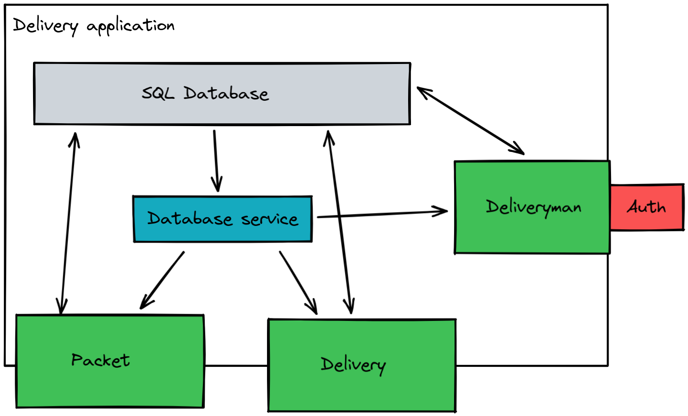

# Workshop Software

:heavy_check_mark: Discover [Encore](https://encore.dev/) a powerful go framework to develop APIs.  

:heavy_check_mark: Learn services logics

:heavy_check_mark: Improve your Go and architecture design skills

## Introduction

With the evolution of the web the arrival of Saas, Paas, Iaas, develop and deploy an API has become a *must-have* knowledge.
More and more frameworks exist to code faster, optimize deployment, remove boring boilerplate but there is no solution that manage both of those things for you.

[Encore](https://encore.dev/) does, it's a powerful golang framework that help you to build production-ready API and services without coding boilerplate, pay attention to the deployment or manage your database. In conclusion, [Encore](https://encore.dev/) helps you to stay focus on the most important thing : your product.

In this workshop, we will create a simple delivery application that will manage packets to understand and uses all features available by [Encore](https://encore.dev/).

## Step 0 - Setup

Before starting the workshop, make sure you've completed all steps of the [setup](./SETUP.md).

## Step 1 - Discover Encore

We are not going to develop an API with a real use-case now, to begin we will write some endpoints to understand how `Encore` handle requests and responses.

First, create a new folder named `discovery` and create the file `discovery.go` in it.

> With encore, each directory that contains an endpoint is considered as a *services*.

We are going to create **3** endpoints :

##### 1 - URLParam

That endpoint aim to retrieve the parameter from the url.

Create the function `URLParam` which takes a `string` named `param` as url parameter.
It should return an object of type `URLParamResponse`  which contains a field  `Message` of type `string`.

:warning: The message's content must be `Received a query with '<$param>' as url parameter`.

:bulb: You must [configure your function](https://encore.dev/docs/develop/services-and-apis#access-controls) to be reached through a request to `/url/:param` with the `GET` method.

Example
```shell
curl http://localhost:4000/url/test
{
  "message": "Received a query with 'test' as url parameter"
}

```

##### 2 - QueryParam

This one aim to retrieve the parameter from query parameters

Create the function `QueryParam` which takes as query parameter two fields :
- `Foo` of type `string`
- `Bar` of type `int`

It should return an object of type `QueryParamResponse` which contains a field `Result` of type `string`.

:warning: The result's content must be `Received a query with param foo='<$Foo>' and param Bar='<$Bar>'`

:bulb: You must [configure your function](https://encore.dev/docs/develop/services-and-apis#access-controls) to be reached through a request to `/query` with the `GET` method

Example
```shell
curl http://localhost:4000/query\?foo\=test\&bar\=3
{
  "result": "Received a query with param Foo='test' and param Bar='3'"
}
```

##### 3 - BodyParam

The last one aim to retrieve values from the body.

Create the function `BodyData` which takes a body with two fields :
- `Title` of type `string`
- `Content` of type `string`

It should return an object of type `BodyDataResponse` which contains a field `Message` of type `string`

:warning: The message's content must be `Received a body with title ='<$Title>'' and content='<$Content>'`

:bulb: You must [configure your function](https://encore.dev/docs/develop/services-and-apis#access-controls) to be reached through a request to `/body` with a `POST` method.

Use the [dashboard](https://encore.dev/docs/observability/dev-dash) to test your function, it should be easier than a `curl` command.

## Step 2 - Delivery's API

Now it's time to start the real subject.

The purpose is to create a simple delivery API that will manage packets & deliverymen.

Here's a simple architecture to illustrate the proposal



We will store our data in an SQL database managed by encore.

Then we will create a client and handle database initialization in `database` service.
The client will be forward to our other services:
- `packet`: manage packets
- `delivery`: manage delivery
- `deliveryman`: manage deliverymen

This way, we got independant service that share the same database to simplify data management, specialy when we will need to handle relation between our tables.

> deliverymen will be protected with an authentication process explained further.

#### Database

First, create a new folder named `delivery`, this is where we will code our `develiry-api`.

Before coding our API, we must define models and create our database.

We are lucky, [encore](https://encore.dev/docs/develop/databases) manage the boring stuff for you, you only have to create a `migrations` directory in a `service` that will store your `sql` files and everything will work automatically.

Let's create our database :
- Create a `database` service
- Create a directory `migrations` in your service
- Create a file named `1_create_database.up.sql` in that folder

Paste the following table definition
```sql
--  
-- Extensions  
--  
CREATE  
EXTENSION IF NOT EXISTS "uuid-ossp";

--  
-- Packets  
--  
CREATE TYPE PacketStatus as ENUM('Send', 'Traveling', 'Received');  
  
DROP TABLE IF EXISTS packet;  
CREATE TABLE packet  
(  
 id             uuid         DEFAULT uuid_generate_v4() PRIMARY KEY,  
 owner          VARCHAR,  
 receiver       VARCHAR,  
 destination    VARCHAR,  
 status         PacketStatus DEFAULT 'Send',  
);
```

> The purpose of this workshop is not to waste your time with postgresql, we keep it for another workshop :laught:

Then, you will need to define your entities as go code to easily manage it in our API

- Create a folder `entities` in `database`
- Create a file `entities.go`.
- In this file, you will define a [struct](https://gobyexample.com/structs) `Packet` with fields corresponding to the database model.

> :bulb: Don't lost time defining an enumeration if you are not familiar with Go.

You will also need to export your database client to execute SQL query on your models.

Copy the content below in a file named `client.go`

```go
package database  
  
import (  
 "context"  
  
 "encore.dev/storage/sqldb"  
 "github.com/jmoiron/sqlx"
 _ "github.com/lib/pq"  
)  
  
var (  
 // Package name is the database name  
 rawDb = sqldb.Named("database").Stdlib()  
 db    = sqlx.NewDb(rawDb, "postgresql")  
)  
  
// Client give access to the database clientfunc Client() *sqlx.DB {  
 return db  
}  
  
// Placeholder used to create the SQL database//encore:api private  
func Placeholder(_ context.Context) error {  
 return nil  
}
```

Here we are exporting a client from [sqlx](https://pkg.go.dev/github.com/jmoiron/sqlx) ORM, a wrapper around [sql](https://pkg.go.dev/database/sql) to execute query easily.

> :bulb: Note that `encore` provide his own version of the [sql](https://pkg.go.dev/database/sql) package named `sqldb`.

#### Packet's time

Now we will create our endpoints to manage our packets.

Create a new service named `packet` in the `delivery` folder.

First, we must retrieve our database client, to do so a file named `packet.go` that will export a variable `db` initialize by `database.Client()`.

> The [init](https://golang.org/doc/effective_go#init) function could be useful.

Next, let's expose endpoints to read our packets.

Create the file `get.go` that will contain two functions :

- `GetAll` that will retrieve **all** packets stored in the database.
  You must return an object with the list of all packets and the number of package.
  Your endpoint must be public and reachable with a request `GET` on `/packet`

- `Get` that will retrieve **one** packet selected by his unique identifier.
  Your endpoint must be public and reachable with a request `GET` on `/packet/:id` where `:id` is your identifier

> Do you remember how works url parameters ?

Great, we read data, but isn't better if we can add some to test our endpoints ?

Let's create the file `add.go` that will handle the creation of packet.

Create the function `Add` that will take as parameter a `CreateDTO` which contains an `owner`, a `receiver` and a `destination`.
You will create a new packet in your database from this information and return a message of confirmation if everything went well.

Your endpoint must be public and reachable with a request `POST` on `/packet`

Perfect, now verify your endpoint with the [awesome encore dashboard](https://encore.dev/docs/observability/dev-dash) created when you run `encore run`.

#### Bonus

If you are a brave developer, you can continue with `Update` and `Delete`. You got the logic so it shouldn't be a big deal for you now :rocket:

## Step 3 - Hire employee

Fun begin, we can receive and manage packet but no one can send it to their destination.

How about creating a new service to handle `deliveryman` ?

First, we must improve your `database` service to handle the relation between `packets` & `deliveryman`.
Since encore doesn't currently support powerful ORM like [ent](https://entgo.io/) or [goORM](https://gorm.io/index.html), we will need to query our data with raw SQL.
It's not really easy for a beginner so to keep concentrate on encore, you will replace your `database` service with the [one provide in the workshop](./source/step2/database-service.zip).

Your `database` service should now have the following architecture.

```sh
├── client.go
├── entities
│   ├── entities.go
│   └── status.go
├── migrations
│   ├── 1_create_database.up.sql
│   └── 2_create_views.up.sql
├── result.go
└── utils
    └── buildUpdateArgs.go
```

Now, create a new `deliveryman` service at the root of your folder `delivery` and a file that will retrieve your database client.

#### Our first employee

Let's take a look at the `deliveryman` table in the database

```sql
CREATE TYPE DeliveryManStatus as ENUM('Available', 'Working');  
  
DROP TABLE IF EXISTS deliveryman;  
CREATE TABLE deliveryman  
(  
 id     uuid           DEFAULT uuid_generate_v4() PRIMARY KEY,  
 name   VARCHAR,  
 status DeliveryManStatus DEFAULT 'Available'  
);
```

As you see, the only required property is `name`.

So now, create the file `add.go` in that new service.

In this one, write a function `Add` that will take a `CreateDTO` as parameter that contains the deliveryman's `name`.
Then, add it to your database and return a message of confirmation.

You endpoint must be reachable with a request `POST` on path `/deliveryman`

#### What's the passphrase sir ?

If you don't notice, there was no instruction about the kind of endpoint your `Add` function must be, is it public, private or auth ?

We don't really want to allow anyone adding an employee so we should be able to authenticate the one that trying to create a resource on our service.

Storing the caller identity will be too long for a workshop and involve to design `login` and `logout` endpoint, instead we will just use a simple `passphrase` as proof of our identity.

> :warning: I **DON'T** recommend that method in production API, it's just to win time.

Encore framework provide an [elegant way](https://encore.dev/docs/develop/auth) to manage our authentication system through a simple keyword : `authHandler`.

Create a new service named `auth` in the `delivery` folder.

Use the [secrets integration](https://encore.dev/docs/develop/secrets) of encore to create a secret variable named `Token` that will store your passphrase.

Then create a function named `AuthHandler` that will check that the `Authorization` header contains the same value of our `token`.
In case of error, return a [custom error](https://encore.dev/docs/develop/auth#handling-auth-errors) with error code `401` and a an error message.

> Don't forget the annotation.
> You can use any word as passphrase.

Now you can add the keyword `auth` to the function `Add`.

Great, your endpoint is protected ! Test it with the dashboard.

#### Manage deliverymen

You are now ready to complete other function.

We want to :
- List all deliverymen
- Get a deliveryman information selected by his ID

All those endpoints must be only reachable by an authenticated person so don't forget the `auth` annotation.

As a bonus, you can also write update & delete endpoints.

## Step 4 - Send request

We have deliverymen and packets, the only missing part is the `delivery` service.

Create it in the `delivery` folder (*yes they are nested*).

#### Send & receive

As usual, retrieve your database client in a file named `delivery.go`.

Now let's expose your functions.

- Create a function `SendPacket` that will take as argument `SendPacketDTO` which contains the `packetID` and the `deliverymanID`.
  You function must update the target packet status and assign that one to the deliveryman. You also need to update your deliveryman's status.
  Return a message of confirmation if everything went well.

- Create a function `ReceivePacket` that will do the same as `SendPacket` but with different status.
  Your deliveryman should be `available` after the customer `received` his packet.

Those two functions must be public and reachable with a request `POST`. You are free to choose the name of your endpoints.

> :bulb: You can also write some error handling about status. For example, a deliveryman with the status `working` can not handle an other delivery request.

#### Who's the owner

> :bulb: This step is a bonus.

I think you notice it but we can't actually see the links between deliverymen and packets when we retrieve our list of packet or deliverymen.

That would be awesome to get something like this when we reach `/deliveryman`

```json
{
  "number": 3,
  "deliverymans": [
    {
      "id": "5a79fe3c-fd69-4e09-9332-cd9179a5fe41",
      "name": "John",
      "status": "Available",
      "packets": [
        {
          "id": "c52657bd-1bb0-4add-a0de-d5df24022232",
          "owner": "Botea",
          "receiver": "Mr Who",
          "destination": "Moon",
          "status": "Send"
        },
        {
          "id": "0cd01b01-c850-42d2-a451-72de4469fa45",
          "owner": "MoDonald",
          "receiver": "MrKing",
          "destination": "Hell",
          "status": "Traveling"
        }
      ]
    },
    {
      "id": "19a7b91f-8b57-4512-be66-d53b2602178b",
      "name": "Sonic",
      "status": "Available",
      "packets": [
        {
          "id": "65428358-fb2e-4fbb-a6a3-82f114f2b86e",
          "owner": "Knukle",
          "receiver": "Peach",
          "destination": "Smash",
          "status": "Received"
        }
      ]
    },
    {
      "id": "ae05ea27-9a24-4fdf-87dd-70260a4ad40d",
      "name": "Mr Jones",
      "status": "Working"
    }
  ]
}
```

Find a way to get that result.

:bulb: They are views created when initialized the database, maybe that could help you.

Congratz ! You finished that workshop and build your own delivery API with [Encore framework](https://encore.dev/).

## Bonus

- [Custom your logs](https://encore.dev/docs/observability/logging)
- [Test your API](https://encore.dev/docs/develop/testing)
- [Use Firebase Auth](https://encore.dev/docs/how-to/firebase-auth)
- [Generate an API client](https://encore.dev/docs/how-to/integrate-frontend)
- [Handle webhook](https://encore.dev/docs/how-to/webhooks)

## To go further

- [Discover Encore community](https://encore.dev/docs/community)
- [Deploy in production](https://encore.dev/docs/deploy/platform)
- [Monitor your application](https://encore.dev/docs/observability/monitoring) 

## Authors

| [<br><sub>Tom Chauveau</sub>](https://github.com/TomChv) | 
| :---: |
<h2 align=center>
Organization
</h2>
<br/>
<p align='center'>
    <a href="https://www.linkedin.com/company/pocinnovation/mycompany/">
        
    </a>
    <a href="https://www.instagram.com/pocinnovation/">
        
    </a>
    <a href="https://twitter.com/PoCInnovation">
        
    </a>
    <a href="https://discord.com/invite/Yqq2ADGDS7">
        
    </a>
</p>
<p align=center>
    <a href="https://www.poc-innovation.fr/">
        
    </a>
</p>

> :rocket: Don't hesitate to follow us on our different networks, and put a star 🌟 on `PoC's` repositories.
