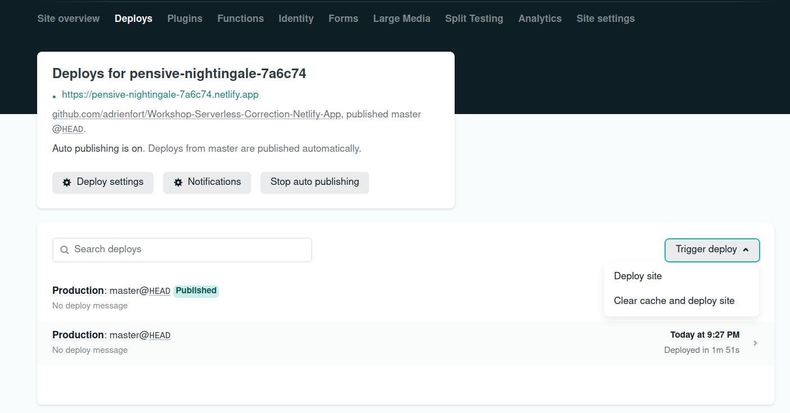

# Workshop 22 - Serverless ✨
✔️ Learn the basics of Serverless, an architecture helping you saving time and money.  
✔️ Serverless App using [Netlify](https://www.netlify.com/), [React](https://fr.reactjs.org/) TS and [Chakra UI](https://chakra-ui.com/)  
✔️ Serverless API using [Serverless Framework](https://www.serverless.com/)  

## Introduction 🔰
**What you will do and why:**  
Let's say you want to build an application. One of the things you need to think about is **servers**. Sometimes there is a high traffic, sometimes a low traffic. You want to handle it, so you have for now two options:  
- The first is pay for a lot of server ressources, so that even in high traffic your server can handle it.
But during low traffic, you will pay for these ressources too. That's not a good thing because you don't **pay for what you use**.  
- The second option is to have **scalable** servers. It means that you allocate the right ressources depending on your traffic. To create this process, you can use [kubernetes](https://kubernetes.io/fr/docs/concepts/overview/what-is-kubernetes/). **METTRE LE LIEN DU WS KUBERNETES**  
  
However this second solution is something very long to implement. And you just want to stay focus on your code. You don't want to care about the server managment.  
Well you have a third option.   You can adopt a **serverless architecture**.  

**But what is a serverless architecture ?**  
When you build an API to link you frontend with your database for instance, you useally run it on a server. This means that a server il allocated and listen to the queries to this API.  
  
Well using a serverless archtitecture, it's different.  
  
You don't allocate a specific server listening on the queries to your API. You just choose a cloud provider ([aws](https://aws.amazon.com/fr/), [scaleway](https://www.scaleway.com/en/), ...), and you give it your API's functions, one by one. They will be called **serverless functions**.  
You don't give the whole API to a server ! You just give to the cloud provider your functions one by one.  
  
As a concequence, when a query is made to call the API, it will create a container on a server of the cloud provider, and run the funciton inside.  
The benefits are the following: 
- The cloud provider create as much containers as queries, so you have a scalable API.
- You pay for what you use. You pay for the numbers of containers created.
- All that without implementing a server setup. You just give to the cloud provider your functions, it holds the rest.

**It's very usefull ... but not always !**  
It depends on what you want to do !  
In fact there are some drawbacks using a serverless architecture.  
First, a serverless function has a limite of 15 minutes of running. So you can't build a game using a serverless architecture.  
Then, a serverless function needs sometimes a cold start before running. Depending on the cloud provider you will use, you can loose up to 4 seconds !
> A cold start appened when the serverless function hasn't been running since a defined period (depending on the cloud provider). As a concequence, a container (in wich the function will be executed) needs to be created.

The **perfect scenario** is the following:  
You have an application where all functions are relatively short (0-15 mins), and are called regulary by the users. In this case adopting a serverless architecture is awsome because you pay for what you use, and you stay focus on your code.  
  
For more explanations, you can watch [this video](https://www.youtube.com/watch?v=tgFiOzVEL0Q) 👀

## Step 0 - Setup
Please follow the steps in the [SETUP.md](./SETUP.md)  
**Done ? You are now ready to go ! 🔥**

## Step 1 - Build your app
- Go to your Serverless Gifs App repository  
- Build the app.
  > You will need a [form](https://fr.reactjs.org/docs/forms.html), an [input](https://chakra-ui.com/docs/form/input), a [button](https://chakra-ui.com/docs/form/button) and some [iframe](https://developer.mozilla.org/fr/docs/Web/HTML/Element/iframe)

[Click to see an example of what you can do](https://eager-albattani-482adb.netlify.app/) 👀  
**For now, you will call the giphy API inside the frontend of project**  
  
**Usefull links:**
- [React State Hook](https://fr.reactjs.org/docs/hooks-state.html)
- [React Effect Hook](https://fr.reactjs.org/docs/hooks-effect.html)
- [Chakra UI](https://chakra-ui.com/)
- [Giphy API documentation](https://developers.giphy.com/explorer#explorer)
  > We advise you to search with a limit of 9 records to return

**If you've never learn react, live coding ! 🎥**

## Step 2 - Deploy your app
**Follow these steps:**
- Commit and push your work

> Then you will deploy your application on Netlify
- Go to your [Netlify](https://www.netlify.com/) account, `Team overview` and click the `New site from Git` button
  

    
See the button

  
   

  

- Select Github for Continious Deployment
  

    
See the button

  
   

  

- Choose your Serverless Gifs App repository
- Deploy your application with the default settings  
  **Warning: be aware to the branch to deploy: select your default repository branch**
  

    
See the default settings

  
   

  

> Good ! Your application is now deployed ! But if you try to use it, we can see that it doesn't work, you get a full blanck page 🤔  
> Can you guess what the problem is ?  
> Well, you didn't setup your environment variables !  
> Lets do it ⤵️
- Go to `Site Settings`, then `Build and deploy`, scroll to the bottom. You will see an `Environment` section
- Click the `Edit variables` button
  

    
See the button

  
   

  

- Add your `REACT_APP_GIPHY_API_KEY` environment variable and SAVE
- Go to `Deploys`, click the `Trigger Deploy` button and select `Deploy Site`
  

    
See the button

  
   

  

- If you refresh your application page, you should now not see a blanck page, but what you've coded.

**Your application is now working on production !! 🔥🔥 You can share it 😎**  

## Step 3 - Create your first serverless function
**Usefull link:**
- [Netlify Serverless Functions Configuration](https://docs.netlify.com/functions/configure-and-deploy/)
- [Netlify Serverless Functions in Typescript](https://docs.netlify.com/functions/build-with-typescript/)
- [How to run Netlify functions](https://www.netlify.com/products/dev/#how-it-works)

Once you're done, just push your work on your default branch. Netlify will automatically detect changes and will deploy your application.
**Amazing 🎆, isn't it ?**

## Step 4 - Create your first serverless API
- Go to your Serverless API folder
- Create a file named `fetchGiphy.ts` in wich you will implement the function to fetch the Giphy API. You can have a look to the file `setup.ts` to learn how to do it
- Update the file `serverless.yml` in order to call your new function. See the [documentation](https://www.serverless.com/framework/docs/providers/aws/guide/events/)
- Create a file `fetchGiphy.test.ts` inside `tests` folder and implement some code to test your new function. You can have a look to the file `tests/setup.test.ts`, or read the [jest documentation](https://jestjs.io/docs/using-matchers) to learn how to do it

**Usefull commands**
- `serverless invoke local -f [YOUR FUNCTION NAME - example: setup]` to call a serverless function
- `serverless invoke local -f [YOUR FUNCTION NAME] --data '{ "queryStringParameters": {"input":"kaamelott"}}'` to call a serverless function with query parameters
- `yarn test` to run tests

## Bonus:
- Deploy your API with [aws](https://aws.amazon.com/fr/lambda/) (or better: with the [scaleway](https://www.scaleway.com/en/docs/scaleway-elements-serverless-getting-started/) 🇫🇷), and call it inside your serverless app !
- Discover [Vercel](https://vercel.com), a Netlify competitor with our [workshop](https://github.com/PoCInnovation/Workshops/tree/feat/software-ws-serverless/software/14.Vercel)

## Author
- [Adrien Fort](https://github.com/adrienfort)

Thanks to [Tom Chauveau](https://github.com/TomChv) for contributing to this workshop by submitting his reviews !

Made with :heart: by PoC.

## Organization

- [📒 Linkedin](https://www.linkedin.com/company/pocinnovation/mycompany/)
- [📷 Instagram](https://www.instagram.com/pocinnovation/)
- [🖱️ Website](https://www.poc-innovation.fr/)
- [🌐 Discord](https://discord.gg/Yqq2ADGDS7)

> :rocket: Don't hesitate to follow us on our different networks, and put a star 🌟 on `PoC's` repositories.
