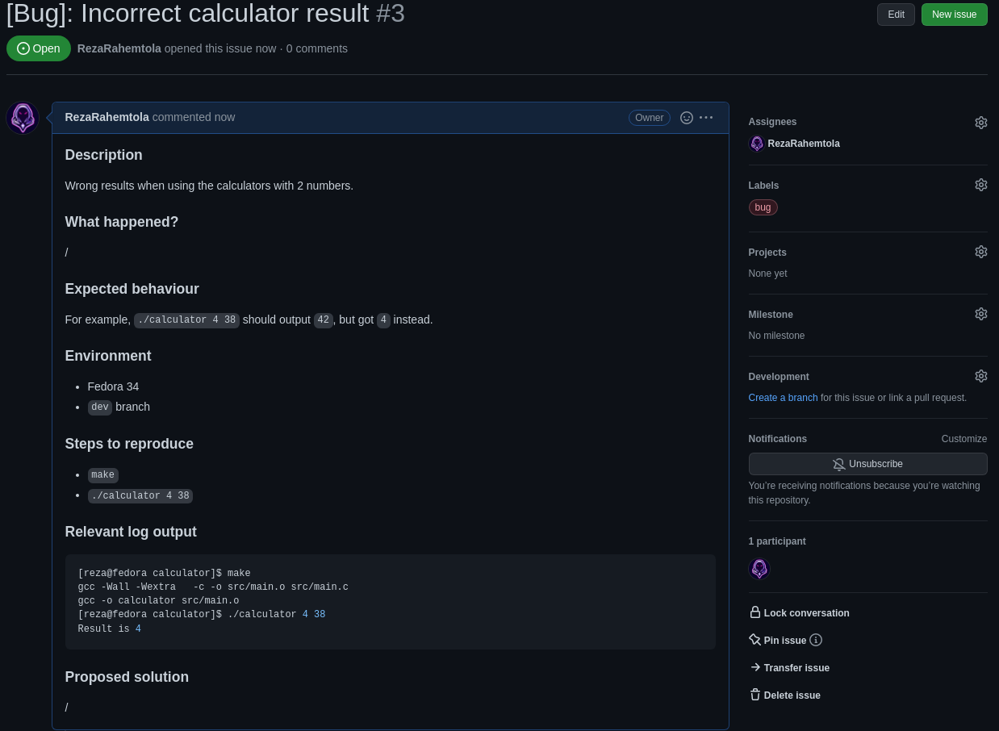
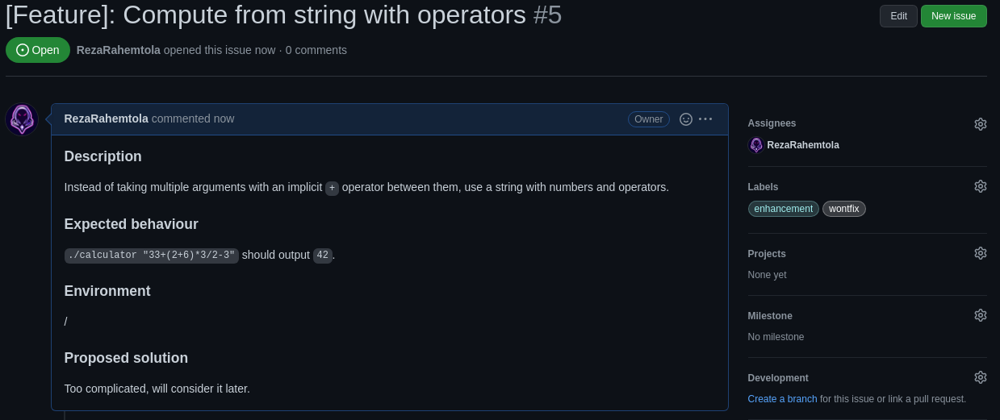

# Part 2: GitHub :rocket:

## Step 0 - Project initialization
Create a repository and commit the files & folders contained in [project folder].
Some steps should be completed in groups of at least 2.
Go to your repository settings, and in the `Collaborators` add your teammate !

<i>Pro tips:</i>
> Don't forget to use the commit norm you learned in the previous part :wink:

> Don't forget to use branches ! This time, try to create it directly in GitHub :rocket:

> This workshop is based on [PoC Innovation's Open-Source project template](https://github.com/PoCInnovation/open-source-project-template).  
Several links to specific parts of the [getting started guide](https://github.com/PoCInnovation/open-source-project-template/blob/main/.github/getting-started.md) will be given to you, but don't spend too much time on it, we have a lot to cover ! You can read it entirely later.

## Step 1 - [Issues](https://docs.github.com/en/issues/tracking-your-work-with-issues/about-issues) & [Pull Requests (PRs)](https://docs.github.com/en/pull-requests/collaborating-with-pull-requests/proposing-changes-to-your-work-with-pull-requests/about-pull-requests)
### :bookmark_tabs: **Description**:
On a project, you'll need a tool to track and organize your work: with GitHub Issues, you can track feature requests, user feedbacks and bug reports.  
Contributions can also be managed with Pull Requests to review code and discuss about it before merging on another branch.  
If you played a bit with the calculator you may notice the given result isn't correct.

### :pushpin: **Tasks**:
You have to create 3 issues:
- One to describe the problem, with expected behaviour and what you are experiencing.
- Another to suggest a feature (add all the arguments instead of just the first 2)
- A last one to take a single string as parameter and support operators in it (this one will not be implemented)

Then you have to create two branches (`fix/wrong-result` and `feat/multi-arguments`) and solve the related issues on it.  
Create a Pull Request for each branch and use 2 different methods to link the related issues.
When it's done, add your teammate as reviewer and play with the review tool in the `Files Changed` tab !

### :books: **Documentation**:
- [Classification with labels](https://docs.github.com/en/issues/using-labels-and-milestones-to-track-work/managing-labels)
- [Assignment](https://docs.github.com/en/issues/tracking-your-work-with-issues/assigning-issues-and-pull-requests-to-other-github-users)
- [Closing keywords](https://docs.github.com/en/get-started/writing-on-github/working-with-advanced-formatting/using-keywords-in-issues-and-pull-requests)

> Instead of organizing the content manually, you can use templates for [issues](https://docs.github.com/en/communities/using-templates-to-encourage-useful-issues-and-pull-requests/configuring-issue-templates-for-your-repository) and [PRs](https://docs.github.com/en/communities/using-templates-to-encourage-useful-issues-and-pull-requests/creating-a-pull-request-template-for-your-repository). It's really useful to let contributors know what information maintainers need and keep a common structure between contributions.  
You can find some great examples for different types of issues in [our Open-Source project template](https://github.com/PoCInnovation/open-source-project-template/tree/main/.github/ISSUE_TEMPLATE) as long as [one for Pull Requests](https://github.com/PoCInnovation/open-source-project-template/blob/main/.github/pull_request_template.md).

### :heavy_check_mark: **Validation**:
Try to make it as complete as possible, then take a look at the expected results:

  
Problem issue

  

  
Feature issue

  

  
Not implemented issue

  

  
Problem PR

  

  
Feature PR

  

  
PR review example

  

## Step 2 - [Projects](https://docs.github.com/en/issues/organizing-your-work-with-project-boards/managing-project-boards/about-project-boards) & [Milestones](https://docs.github.com/en/issues/using-labels-and-milestones-to-track-work/about-milestones)
### :bookmark_tabs: **Description**:
You can manage features and tasks with issues, group commits and do code reviews with PRs, but how do you actually organize
your work in tables like well-known ticketing tools ? That's where GitHub Projects come into play !

### :pushpin: **Tasks**:
Create a project named `Calculator` with 3 columns (by default `To do`, `In progress` and `Done` but you can rename it) with automation to add issues in `To do` when they are created, move created PRs to `In progress` and fill the `Done` column when closing issues or merging PRs.

### :heavy_check_mark: **Validation**:
You can test it by creating other issues:

  
Creating an issue

  

  
Closing an issue

  

  
Project view example

  

> A [new GitHub Project experience](https://docs.github.com/en/issues/trying-out-the-new-projects-experience/about-projects) is currently in public beta. We chose not to cover it because it's subject to major changes, but it brings great features such as [custom fields](https://docs.github.com/en/issues/trying-out-the-new-projects-experience/about-projects#adding-metadata-to-your-tasks) and [different views](https://docs.github.com/en/issues/trying-out-the-new-projects-experience/about-projects#adding-metadata-to-your-tasks).

### :bookmark_tabs: **Description**:
Organizing taks with states like `To do`, `In progress` and `Done` is great, but how to you handle deadlines and group several issues and PRs
linked to a sprint for example ? Milestones are exactly what you need !  
You can find them in the `Issues` tab.

> You won't find a lot of documentation about it, but it's also possible to create [milestone templates](https://github.com/PoCInnovation/open-source-project-template/blob/main/.github/milestone_template.md) 🚀

## Step 3 - [Actions](https://docs.github.com/en/actions/learn-github-actions/understanding-github-actions)
### :bookmark_tabs: **Description**:
Keeping your code clean and making sure it still works as intended when you develop new features is very important, and GitHub provides you a useful tool for this: Actions !  
Whether you want to build, test or deploy your code, you can create custom workflows triggered by any GitHub event (push, pull_request, new issue...)

### :pushpin: **Tasks**:
Follow [this quickstart](https://docs.github.com/en/actions/quickstart) to create your first action !

> If you want to learn more about GitHub Actions, you can check [our dedicated workshop](https://github.com/PoCInnovation/Workshops/tree/24.Git_Github/software/05.Actions) !

## Step 4 - [Branches protection settings](https://docs.github.com/en/repositories/configuring-branches-and-merges-in-your-repository/defining-the-mergeability-of-pull-requests/about-protected-branches) (optional)
### :bookmark_tabs: **Description**:
Branch protection rules are a great way to enforce good practices.  
For example, your production branch (usually `main`) should be as clean and bug-free as possible, so you don't want to push directly on it and if you have CI tests with GitHub Actions it's a good practice to ensure they all passed when merging on `main`.  
Even if your collaborators and yourself know this, a mistake or a malicious act may occur and enforcing these practices isn't a bad idea.

### :pushpin: **Tasks**:
Go to `Settings` -> `Code and automation` -> `Branches` and add rules to protect your `main` and `dev` branches.
> Take a look at the [protection settings we recommend for `main`](https://github.com/PoCInnovation/open-source-project-template/blob/main/.github/getting-started.md#branches) and don't hesitate to ask if you have any question about it 😉

## To go further
You've learned how to use a lot of tools provided by GitHub, but there's a lot more to discover !

- The [GitHub Learning Lab](https://lab.github.com/) provides some great hands-on courses to grow your skills !  
- [Making open-source contributions](https://docs.github.com/en/get-started/exploring-projects-on-github/finding-ways-to-contribute-to-open-source-on-github) is a great way to apply what you've learned in a real project.  
  Pay attention to `good first issue` labels directly on GitHub or on [dedicated sites](https://goodfirstissue.dev/).
