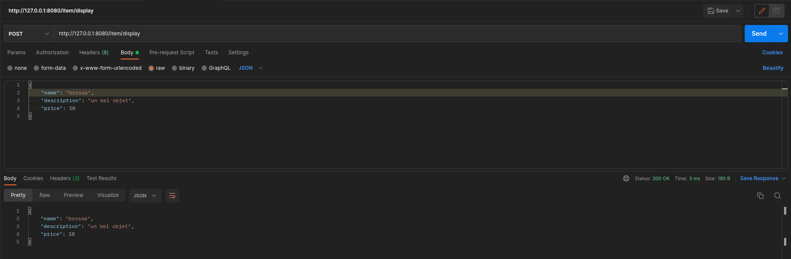

# Workshop - API REST in Go with Gin

:heavy_check_mark: Learn the basics of REST API.

:heavy_check_mark: Learn how to use basic features of the [gin](https://github.com/gin-gonic/gin) framework.

> :bulb: A quick [documentation](https://searchapparchitecture.techtarget.com/definition/RESTful-API) about REST API.

## Step 0: Initialization

All the required information to install the workshop's dependencies are given in the [SETUP.md](./SETUP.md)

#### Gin

Once everything is installed, you have to download the Gin package.

Go at the root of your repo and run this commands to init your go project:
```shell
go mod init workshop-gin
```

Afterwards you can follow the official [documentation](https://github.com/gin-gonic/gin#installation) to install Gin correctly.
>Once again don't hesitate if you have any issue during the installation ! :smile:


**Now everything should work properly you can start the workshop !**

## Step 1: The codebase

We designed a boilerplate for this project, it will be useful to start it, but also to summarize all the required parts of an API
We will have :

- `controllers`: this is where you will design your routes endpoints. it will often be a wrapper that calls other API or the database itself
- `middlewares`: those are a type of function used to intercept and process information between two functions
- `routes`: the core of the router, setting up all the routes handler, with their middlewares and controllers

There are plenty of other important package you may need in a real API, but these are the main one you can be sure you'll need one time or another. Now let's code.

Add a route on the endpoint `/`:
- It uses the `GET` method
- It must call a helloWorld function that responds `"hello: world"` in a json format

> don't hesitate to take a look at the official [documentation](https://github.com/gin-gonic/gin#api-examples).
> You can test it with `http://localhost:8080/` in a browser or with `postman`

## Step 2: Let's get started

You are now fine with the creation of endpoints.
Next step is to create different request method.
There is many [request method](https://developer.mozilla.org/en-US/docs/Web/HTTP/Methods), you already experimented the `GET` request.

For this step, we will use some others' method:
- a `GET` request `/item/template`: to get the template of the item as follows.
```json
{
  "name": "name",
  "description": "description",
  "price": 0
}
```

- a `POST` request `/item/display`: to display the item passed in the body as follows.
  


also try to implement a default endpoint for the URL's that doesn't match any routes. (404 notfound error)


> This [tutorial](https://blog.logrocket.com/making-http-requests-in-go/) may help you

> You should create a structure item with the following fields:
> - name
> - description
> - price
>
> and bind the request body to the structure to retrieve it (do it in a structure folder).
<details>
  <summary>See how to request with postman :satellite:</summary>

Enter your URL and the method you which to use in the title bar and click `Send`.


Then the result (if there is any) will be printed out at the bottom.


</details>

## Step 3: Authorization middleware

Now let's create a middleware `Auth()` that will check if the user is authorized to access the endpoint.

We won't use real token like a [JWT](https://jwt.io/), we will just check if the request contains a header with the name `Authorization` and a value.


## Step 4: Database interaction

For the following we won't use a real database, but we will use a simple json file as the database.
(The configuration would have been too long to explain and to do here)
You can see the database.json in the database folder.


- Create a `GET` request `/item`: to retrieve all the items in the database.
- Create a `POST` request `/item`: to create a new item in the database.

> You must fill the `database/database.go` functions you need (`GetDatabase` & `AddItemInDB`) and call.

> Look at the [documentation](https://tutorialedge.net/golang/reading-writing-files-in-go/) to interact with the file

## Step 5: To go further

To go further you can add some others routes :
- a `DELETE` request `/item`: to delete an item in the database.
- a `PUT` request `/item`: to update an item in the database.
- a `POST` request `/items`: to create multiple items in the database.

## Go

If you still want to toy around with Go and all its usages, you can take a look at other go features like:
- `go routines`
- `interfaces`

You can also use a real database with this ORM packages:
- [Ent](https://github.com/facebookincubator/ent)
- [postgres/ent](https://entgo.io/docs/crud/)

## Authors

| [<br><sub>Ismaël FALL</sub>](https://github.com/Doozers) |
|:-------------------------------------------------------------------------------------------------------------------:|
<h2 align=center>
Organization
</h2>
<br/>
<p align='center'>
    <a href="https://www.linkedin.com/company/pocinnovation/mycompany/">
        
    </a>
    <a href="https://www.instagram.com/pocinnovation/">
        
    </a>
    <a href="https://twitter.com/PoCInnovation">
        
    </a>
    <a href="https://discord.com/invite/Yqq2ADGDS7">
        
    </a>
</p>
<p align=center>
    <a href="https://www.poc-innovation.fr/">
        
    </a>
</p>

> :rocket: Don't hesitate to follow us on our different networks, and put a star 🌟 on `PoC's` repositories.
