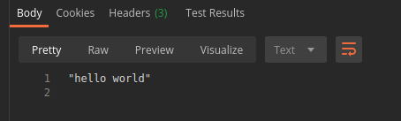

# Workshop - API REST in Go with Gin

:heavy_check_mark: Learn the basics of REST API.

:heavy_check_mark: Discover the basic features of the [gin](https://github.com/gin-gonic/gin) framework.

:heavy_check_mark: Read and write files in Go

> :bulb: A quick [documentation](https://searchapparchitecture.techtarget.com/definition/RESTful-API) about REST API.

## Step 0: Initialization

All the required information to install the workshop's dependencies are given in the [SETUP.md](./SETUP.md)

## Step 1: Hello World!

We designed a boilerplate for this project, it will be useful to start it, but also to summarize all the required parts of an API.  
We will have:

- `controllers`: this is where you will design your routes endpoints. it will often be a wrapper that calls other APIs or make requests to a database.
- `middlewares`: those are used to intercept and process information between two functions. You could typically have a logger middleware that will be called right before your controller.
- `models`: the role of this folder is to contains all the data related code, like type definitions and database logics
- `main.go`: this is the the core of your program: you'll instantiate Gin inside it 😉

There are plenty of other structures you may need in a real API, but these are the main ones you'll need for this workshop.

Now let's code :rocket:

Add a route on the endpoint `/`:
- It uses the `GET` method
- It must call a `HelloWorld` controller that responds `hello world` in a [JSON](https://www.w3schools.com/whatis/whatis_json.asp) format like this:
```json
{
  "hello": "world"
}
```

> Don't hesitate to take a look at the official [documentation](https://github.com/gin-gonic/gin#api-examples) 😉  

> You can test it by opening http://localhost:8080/ in your browser or with Postman!

## Step 2: Diversify your API

Now that you are familiar with the creation of an endpoint, we'll use different HTTP methods!  
You already used `GET`, but [many other exists](https://developer.mozilla.org/en-US/docs/Web/HTTP/Methods) and you can even [pass data to it using headers, body, query params...](https://rapidapi.com/guides/send-data-to-server) :slight_smile:

Let's create two other endpoints:

- `/item/template` that will return the following template of an `Item` on a `GET` request:
```json
{
  "name": "name",
  "description": "description",
  "price": 0
}
```

- a `POST` request on `/item/display` that will take an `Item` from the body of the request, and return it in the response.

> This request should have a result similar to this one:


This may seem hard, but here are a few advices to help you:
> `Item` is a data **model**, creating a structure with its fields (`name`, `description` and `price`) will be necessary.  
> For the `POST` request, you'll then need to bind the request body to the `Item` structure to retrieve and return it, 

<details>
  <summary>See how to request with postman :satellite:</summary>

Enter your URL and the method you which to use in the title bar and click `Send`.


Then the result (if there is any) will be printed out at the bottom.



</details>

## Step 3: Authorization middleware and custom errors

Having multiple endpoints is great, but sometimes we need a way to restrict access to logged in users for example.  
This is where a middleware comes into play :rocket:

Let's create an `Auth` middleware that will check if the user is authorized to access the endpoint.

> We won't use real token like a [JWT](https://jwt.io/) here, but we'll rather just check if the request contains a header with the name `Authorization` and a value to it.

You can add this middleware to the `/item/display` endpoint and check if it works in Postman!

Gin also allows you to use custom controllers on certain errors, let's add one for invalid endpoints (the famous 404 Not Found error).
> [The official README](https://github.com/gin-gonic/gin) could once again help you accomplish this 😉

## Step 4: Database interaction

You've had a glimpse of `models`, now its time to dive into it!
We won't use a real database here but rather a simple json file to mock a database.
> The configuration would have been too long to explain and to do here, but it's surely a great bonus idea when you've completed this workshop :rocket:

You should already have a few items in the `database.json` file given in the boilerplate, so let's implement the following endpoints:

- `/items` to retrieve all the items in the database on a `GET` request
- `/item` with the `POST` method to create a new item

> You must fill the functions you need in `models/item.go` (`GetItems` & `AddItem`) and call them inside a controller 😉

> You'll need to read and write in the JSON file, this [documentation](https://tutorialedge.net/golang/reading-writing-files-in-go/) will be useful for this.

## Bonus

Congratulations for going through this workshop!  
You can go further by adding other methods to complete your database:
- a `DELETE` request on `/item`: remove an item from the database.
- a `PUT` request on `/item` to update an item.
- a `POST` request on `/items` to create multiple items at the same time.

You can also use a real database with an ORM:
- [Ent](https://github.com/ent/ent) and their [CRUD API](https://entgo.io/docs/crud/)
- [GORM](https://github.com/go-gorm/gorm)


And if you still want to play around with Go and all its usages, you can take a look at other cool Go features like [goroutine](https://go.dev/tour/concurrency) or [generics](https://go.dev/doc/tutorial/generics) :rocket:

## Authors

| [<br><sub>Ismaël Fall</sub>](https://github.com/Doozers) | [<br><sub>Reza Rahemtola</sub>](https://github.com/RezaRahemtola) |
|--------------------------------------------------------------------------------------------------------------------------------|------------------------------------------------------------------------------------------------------------------------------------|

<h2 align=center>
Organization
</h2>
<br/>
<p align='center'>
    <a href="https://www.linkedin.com/company/pocinnovation/mycompany/">
        
    </a>
    <a href="https://www.instagram.com/pocinnovation/">
        
    </a>
    <a href="https://twitter.com/PoCInnovation">
        
    </a>
    <a href="https://discord.com/invite/Yqq2ADGDS7">
        
    </a>
</p>
<p align=center>
    <a href="https://www.poc-innovation.fr/">
        
    </a>
</p>

> :rocket: Don't hesitate to follow us on our different networks, and put a star 🌟 on `PoC's` repositories.
